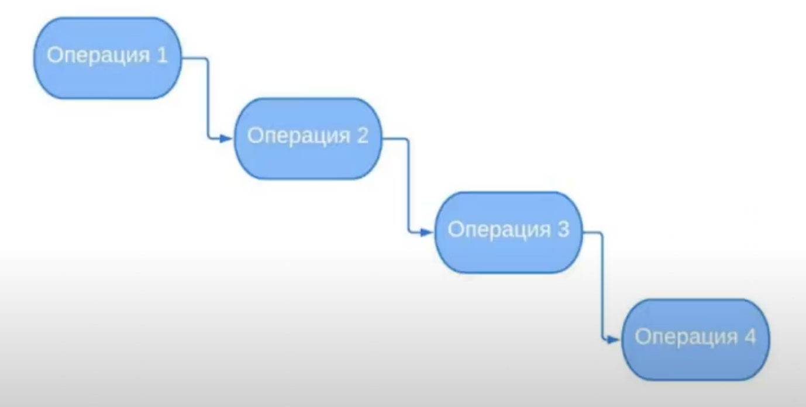
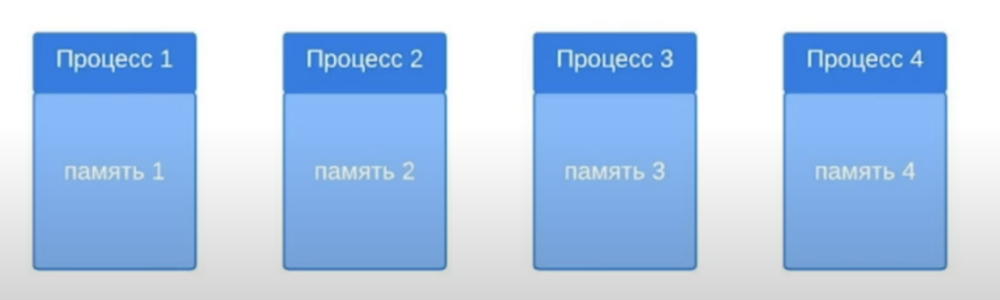
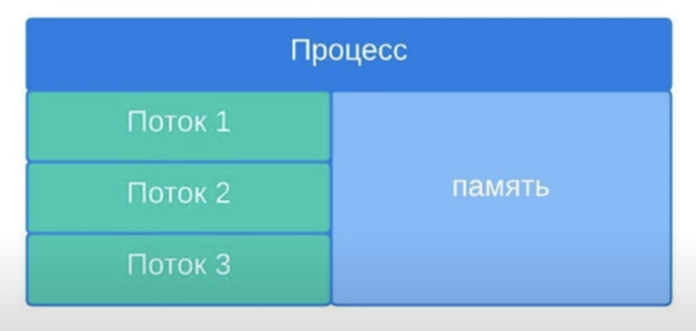

# 1. Поток и процесс

Программы, выполняющие свои инструкции в 1 потоке выполняют
свои инструкции одна за другой. Ни одна инструкция не может выполняться
раньше, чем будут выполнены успешно предыдущие инструкции.



Если операции не связаны между собой, то можно запустить их параллельно.
Допустим, что у нас есть клиент и мы хотим отправить запрос на сервер.
Если будет 2 клиент, то в 1 потоке придется ждать 1 клиента.

```java
public static void main(String[] args){
    final Client first = new Client();
    first.runClient();
    first.doRequest();
    
    final Client second = new Client();
    second.runClient();
    second.doRequest();
}
```

**Многопоточность** - это возможность центрального процессора выполнять
одновременно множество потоков или процессов.

**Процесс** - разграниченная область в памяти. Например, 1 запущенная программа
это 1 процесс. Память предназначенная 1 процессу не пересекается с памятью
другого процесса. Операционная система выделяет каждому процессу свои участки памяти.
В Java есть возможность манипулировать процессами с помощью `ProcessBuilder` 
(в этом конспекте работа с процессами рассмотрена не будет). 
Создание процесса - очень дорогостоящая операция.


**Поток** - легковесный процесс. Поток может создаваться только внутри процесса.
У процесса может быть несколько потоков. Внутри процесса потоки взаимодействуют
с одной и той же памятью. Это весьма рискованно, однако создание потока куда дешевле
чем создание процесса.

