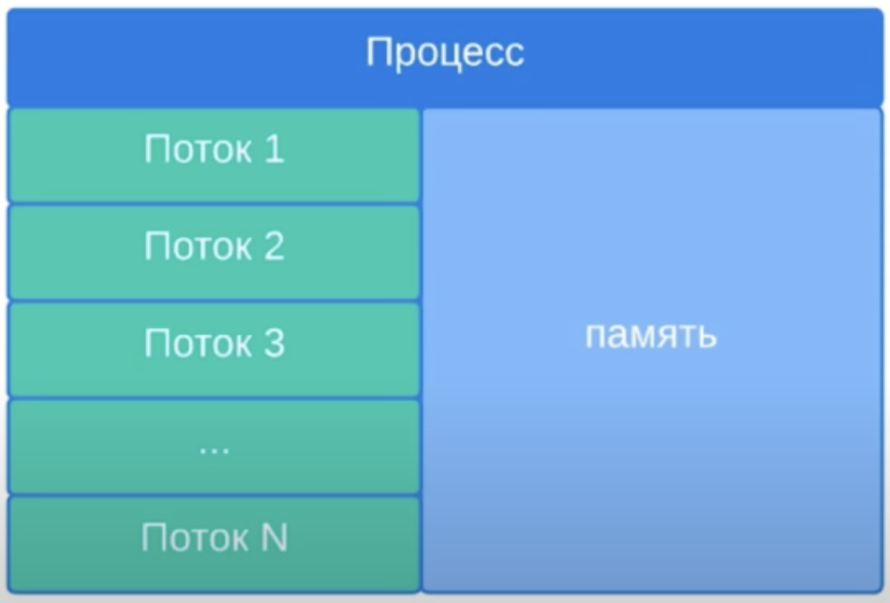
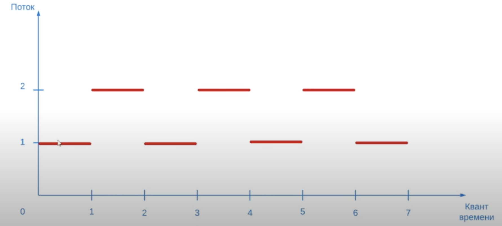
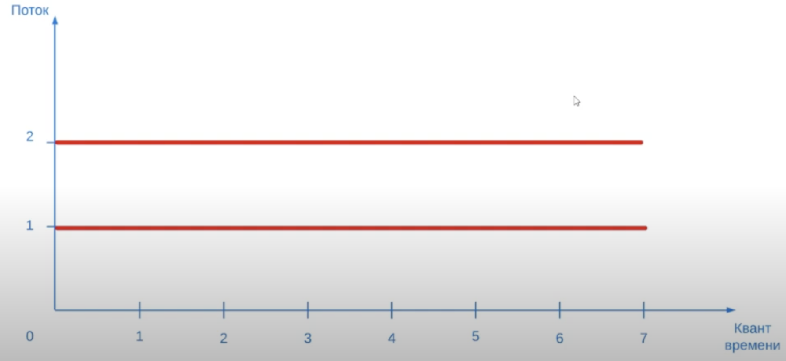

# 2. Квантование времени

Представим, что у нас запущен процесс и в нем запущено N потоков.
Возникает вопрос: как центральный процессор (ЦП) будет обрабатывать эти потоки?

Допустим, что в приложении было запущено 2 потока и у нас есть 1 ядро ЦП.
Потоки будут выполняться следующим образом:

ЦП выделяет квант времени на выполнение 1 потока. Потом он приостанавливает
работу этого потока в той точки, до которой этот 1 поток успел выполниться.
Далее ЦП выделяет квант времени для выполнения 2 потока. 2 поток выполняется
в течение кванта времени, приостанавливает свою работу и переключается на 1 поток.
С той точки на которой он остановился после 1 кванта.

Таким образом, параллельного выполнения в 1 ядерной системе нет. Создается
иллюзия параллельности из-за быстрого переключения процессора между потоками.

Однако если бы у нас был 2 ядерный ЦП, то тогда потоки действительно выполнялись
бы параллельно:

Однако, если в 2 ядерном ЦП появится 3 поток, то снова начнется иллюзия
параллельного выполнения. Это и есть квантование времени.
