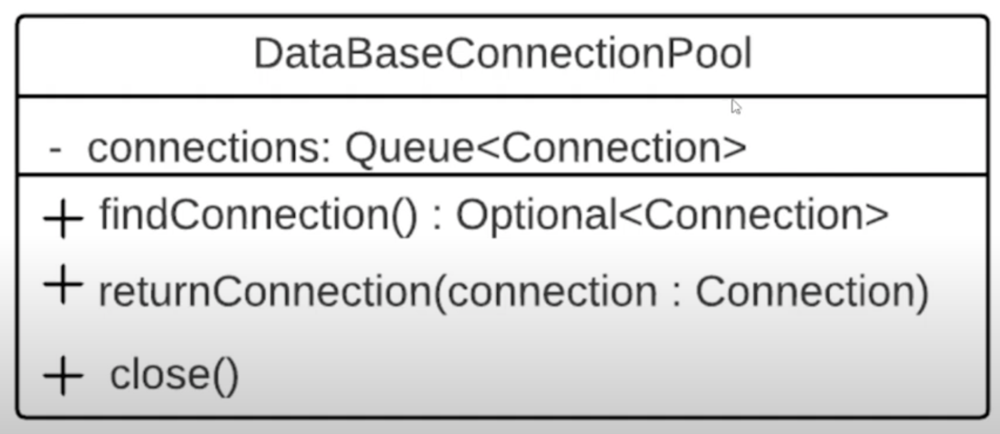

# 4. Недостатки многопоточности

#### 1. Общая память процесса
Только при чтении это не проблема. А когда начинается запись в общий участок
памяти, то тогда и начнутся проблемы.

Допустим, надо создать фабрику подключения к БД:



Когда надо будет отправить запрос в БД, то с помощью этой фабрики мы должны
получить пул соединений. Из него достать соединение, и с помощью него отправить запрос.

```java
private void workWithDB() {
    final DataBaseConnectionPool pool = FACTORY.create();
    final Optional<Connection> optionalConnection = pool.findConnection();
    final Connection connection = optionalConnection.orElseThrow(NoAvailableConnectionInPoolException::new);
    
    try {
        // Работа с БД
    }
    } finally {
        pool.returnConnection(connection);
    }
```

Мы не должны создавать пул подключений при каждом вызове `create()`. Один
раз проинициализировали, все следующие разы брать уже инстанцированный объект. 

Можно сделать это следующим способом:

```java
public final class DataBaseConnectionPoolFactory {
    
    private DataBaseConnectionPool dataBaseConnectionPool;
    
    public DataBaseConnectionPool create() {
        if (this.dataBaseConnectionPool == null) {
            final Queue<Connection> connections = this.createConnections();
            this.dataBaseConnectionPool = new DataBaseConnectionPool(connections);
        }
        return this.dataBaseConnectionPool;
    }
   
    private Queue<Connection> createConnections() {
        // Логика создания очереди соединений
    }
}
```

В однопоточной среде все бы работало. В многопоточной среде возникла бы 
ошибка синхронизации. Например, 1 поток отквантовался на строке создания соединений.
2 поток начал выполняться и тоже попал в `if`-блок. 

#### 2. Сложно обнаружить ошибку синхронизации
Вышеописанная проблема с пулом соединений может себя проявлять 
раз за 1000 выполнений. Если не будем синхронизировать потоки, то стоит
полагаться только на удачу, но проблема когда-нибудь себя проявит.

#### 3. Дорого
Создание нового потока не является дешевой операцией. При переключении
ЦП с одного потока на другой ЦП необходимо запоминать состояние 1 потока,
останавливать его, переключаться на второй поток. Это делает переключение
между потоками также дорогостоящей операцией.

Поэтому не всегда стоит применять многопоточность для ускорения работы 
алгоритма. Применение многопоточности может как ускорить так и замедлить
время исполнения программы.