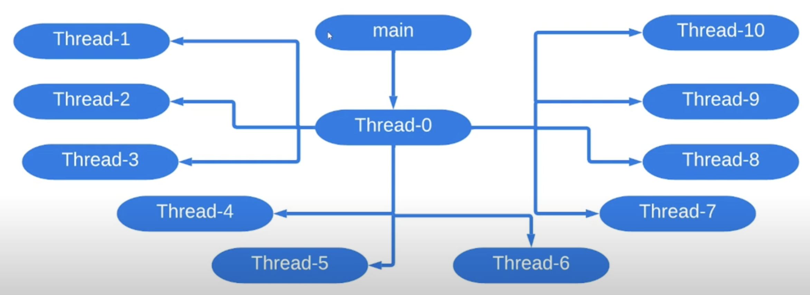

# 5. Создание и старт потока

Все программы написанные на Java запускаются в неявно созданном потоке
`main`. В этом можно убедиться с помощью следующего кода:

```java
public class Runner {
    public static void main(String[] args){
      System.out.println(Thread.currentThread().getName());
    }
}
```

Выведется `main`. Все потоки созданные явно создаются и ответвляются 
от потока `main`.

Явно создать поток можно следующим образом:
#### 1. Создать наследника класса `java.lang.Thread`
```java
public class MyThread extends Thread {
    @Override
    public void run() {
        // code to be executed by thread
    }
}

Thread thread = new MyThread();
thread.start();
```

Можно использовать анонимный класс:
```java
Thread thread = new Thread() {
    @Override
    public void run() {
        // code to be executed by thread
    }
}

thread.start();
```

> Если запустить метод `run()` вместо `start()`, то поток будет
> запущен в потоке `main`

#### 2. Имплементировать интерфейс `Runnable`
```java
final Runnable task = () -> { /*Code to be executed*/ };
final Thread thread = new Thread(task);
thread.start();
```

Хотелось бы заметить, что как потоки наследуются от потока `main`, 
то также явно созданные потоки могут наследоваться от других явно созданных.
Например:
```java
public class Runner {
    
    public static final int CREATED_THREADS_AMOUNT = 10;

    public static void main(String[] args){
      final Runnable taskDisplayingThreadName = () -> System.out.println(Thread.currentThread().getName());;
      final Runnable taskCreatingThreads = () ->
            range(0, CREATED_THREADS_AMOUNT)
                .forEach(i -> startThread(taskDisplayingThreadName));
      startThread(taskCreatingThreads);
    }
    
    private static void startThread(Runnable runnable) {
      Thread thread = new Thread(runnable);
      thread.start();
    }
}
```

В итоге получаем следующую структуру потоков:
