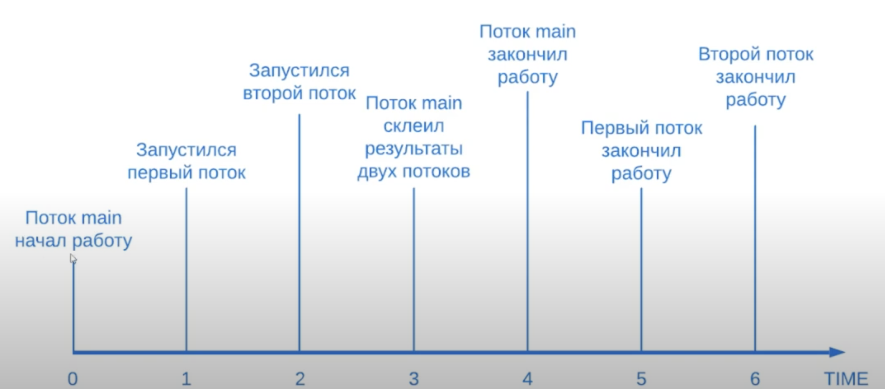
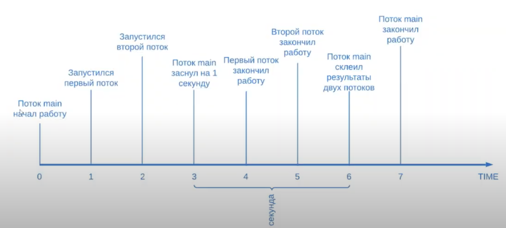
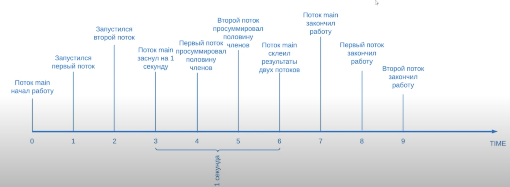
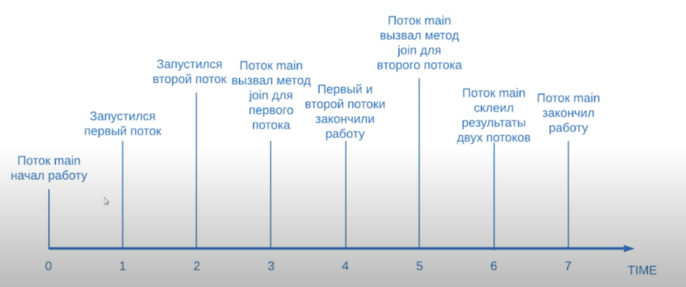

# 6. Методы sleep и join

Задача: нужно просуммировать числа от 1 до 1000. 

Можно реализовать все в 1 потоке:
```java
private static final int FIRST_NUMBER = 1;
private static final int LAST_NUMBER = 1000;

public static void main(String[] args) {
    int sum = 0;
    for (int i = FIRST_NUMBER; i <= LAST_NUMBER; i++) {
        sum += i;
    }
    System.out.println(sum);
}
```

А можно написать программу, которая будет считать в 2 потоках сумму чисел от 1 до 500 и от 501 до 1000.

> Лучше решать через формулу суммы элементов арифметической прогрессии. Но это модельный пример

#### 1. Без ожидания
```java
public class Runner {

    private static final int FROM_NUMBER_FIRST_THREAD = 1;
    private static final int TO_NUMBER_FIRST_THREAD = 500;

    private static final int FROM_NUMBER_SECOND_THREAD = 501;
    private static final int TO_NUMBER_SECOND_THREAD = 1000;

    public static void main(String[] args){
        TaskSummingNumbers firstTask = startSubTask(FROM_NUMBER_FIRST_THREAD, TO_NUMBER_FIRST_THREAD);
        TaskSummingNumbers secondTask = startSubTask(FROM_NUMBER_SECOND_THREAD, FROM_NUMBER_SECOND_THREAD);

        int resultNumber = firstTask.getResultNumber() + secondTask.getResultNumber();
        System.out.printf("%s : %d\n", Thread.currentThread().getName(), resultNumber);
    }

    private static TaskSummingNumbers startSubTask(int fromNumber, int toNumber) {
        TaskSummingNumbers task = new TaskSummingNumbers(fromNumber, toNumber);
        Thread thread = new Thread(task);
        thread.start();
        return task;
    }
    
    private static void startThread(Runnable runnable) {
        Thread thread = new Thread(runnable);
        thread.start();
    }

    private static final class TaskSummingNumbers implements Runnable {

        private static final int INITIAL_VALUE_RESULT_NUMBER = 0;

        private final int fromNumber;
        private final int toNumber;
        private int resultNumber;

        public TaskSummingNumbers(int fromNumber, int toNumber) {
            this.fromNumber = fromNumber;
            this.toNumber = toNumber;
            this.resultNumber = INITIAL_VALUE_RESULT_NUMBER;
        }

        public int getResultNumber() {
            return this.resultNumber;
        }

        @Override
        public void run() {
            rangeClosed(this.fromNumber, this.toNumber).forEach(i -> this.resultNumber += i);
            System.out.printf("%s : %d\n", Thread.currentThread().getName(), this.resultNumber);
        }
    }
}
```

Output:
```
main: 0
Thread-1: 375250
Thread-0: 125250
```



#### 2. Метод sleep()
```java
public class Runner {

    private static final int FROM_NUMBER_FIRST_THREAD = 1;
    private static final int TO_NUMBER_FIRST_THREAD = 500;

    private static final int FROM_NUMBER_SECOND_THREAD = 501;
    private static final int TO_NUMBER_SECOND_THREAD = 1000;

    public static void main(String[] args) throws Exception {
        TaskSummingNumbers firstTask = startSubTask(FROM_NUMBER_FIRST_THREAD, TO_NUMBER_FIRST_THREAD);
        TaskSummingNumbers secondTask = startSubTask(FROM_NUMBER_SECOND_THREAD, FROM_NUMBER_SECOND_THREAD);
        Thread.sleep(1000L);
        int resultNumber = firstTask.getResultNumber() + secondTask.getResultNumber();
        System.out.printf("%s : %d\n", Thread.currentThread().getName(), resultNumber);
    }

    private static TaskSummingNumbers startSubTask(int fromNumber, int toNumber) {
        TaskSummingNumbers task = new TaskSummingNumbers(fromNumber, toNumber);
        Thread thread = new Thread(task);
        thread.start();
        return task;
    }
    
    private static void startThread(Runnable runnable) {
        Thread thread = new Thread(runnable);
        thread.start();
    }

    private static final class TaskSummingNumbers implements Runnable {

        private static final int INITIAL_VALUE_RESULT_NUMBER = 0;

        private final int fromNumber;
        private final int toNumber;
        private int resultNumber;

        public TaskSummingNumbers(int fromNumber, int toNumber) {
            this.fromNumber = fromNumber;
            this.toNumber = toNumber;
            this.resultNumber = INITIAL_VALUE_RESULT_NUMBER;
        }

        public int getResultNumber() {
            return this.resultNumber;
        }

        @Override
        public void run() {
            rangeClosed(this.fromNumber, this.toNumber).forEach(i -> this.resultNumber += i);
            System.out.printf("%s : %d\n", Thread.currentThread().getName(), this.resultNumber);
        }
    }
}
```

Output:
```
Thread-0: 125250
Thread-1: 375250
main: 500500
```



Это плохая реализация, если таски будут выполняться дольше 1 секунды. Может возникнуть следующая ситуация:



#### 3. Метод join
```java
public class Runner {

    private static final int FROM_NUMBER_FIRST_THREAD = 1;
    private static final int TO_NUMBER_FIRST_THREAD = 500;

    private static final int FROM_NUMBER_SECOND_THREAD = 501;
    private static final int TO_NUMBER_SECOND_THREAD = 1000;

    public static void main(String[] args) throws Exception {
        TaskSummingNumbers task1 = new TaskSummingNumbers(FROM_NUMBER_FIRST_THREAD, TO_NUMBER_FIRST_THREAD);
        Thread thread1 = new Thread(task);
        thread1.start();
        TaskSummingNumbers task2 = new TaskSummingNumbers(FROM_NUMBER_SECOND_THREAD, TO_NUMBER_SECOND_THREAD);
        Thread thread2 = new Thread(task);
        thread2.start();

        waitForTaskFinished(thread1, thread2);

        int resultNumber = firstTask.getResultNumber() + secondTask.getResultNumber();
        System.out.printf("%s : %d\n", Thread.currentThread().getName(), resultNumber);
    }

    private static void waitForTaskFinished(Thread... threads) {
        for (Thread thread: threads) {
            thread.join();
        }
    }
    
    private static void startThread(Runnable runnable) {
        Thread thread = new Thread(runnable);
        thread.start();
    }

    private static final class TaskSummingNumbers implements Runnable {

        private static final int INITIAL_VALUE_RESULT_NUMBER = 0;

        private final int fromNumber;
        private final int toNumber;
        private int resultNumber;

        public TaskSummingNumbers(int fromNumber, int toNumber) {
            this.fromNumber = fromNumber;
            this.toNumber = toNumber;
            this.resultNumber = INITIAL_VALUE_RESULT_NUMBER;
        }

        public int getResultNumber() {
            return this.resultNumber;
        }

        @Override
        public void run() {
            rangeClosed(this.fromNumber, this.toNumber).forEach(i -> this.resultNumber += i);
            System.out.printf("%s : %d\n", Thread.currentThread().getName(), this.resultNumber);
        }
    }
}
```

Output:
```
Thread-0: 125250
Thread-1: 375250
main: 500500
```

