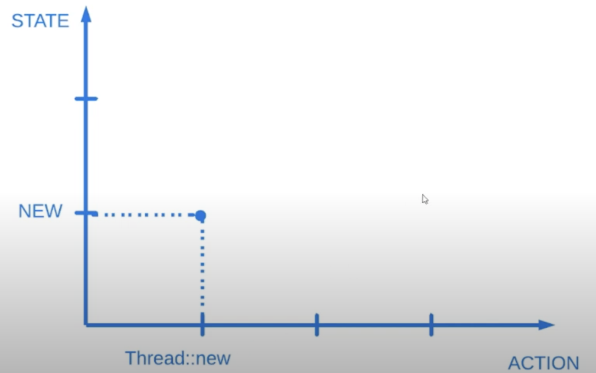
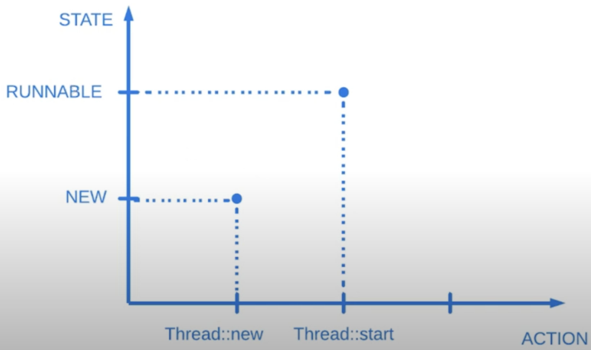
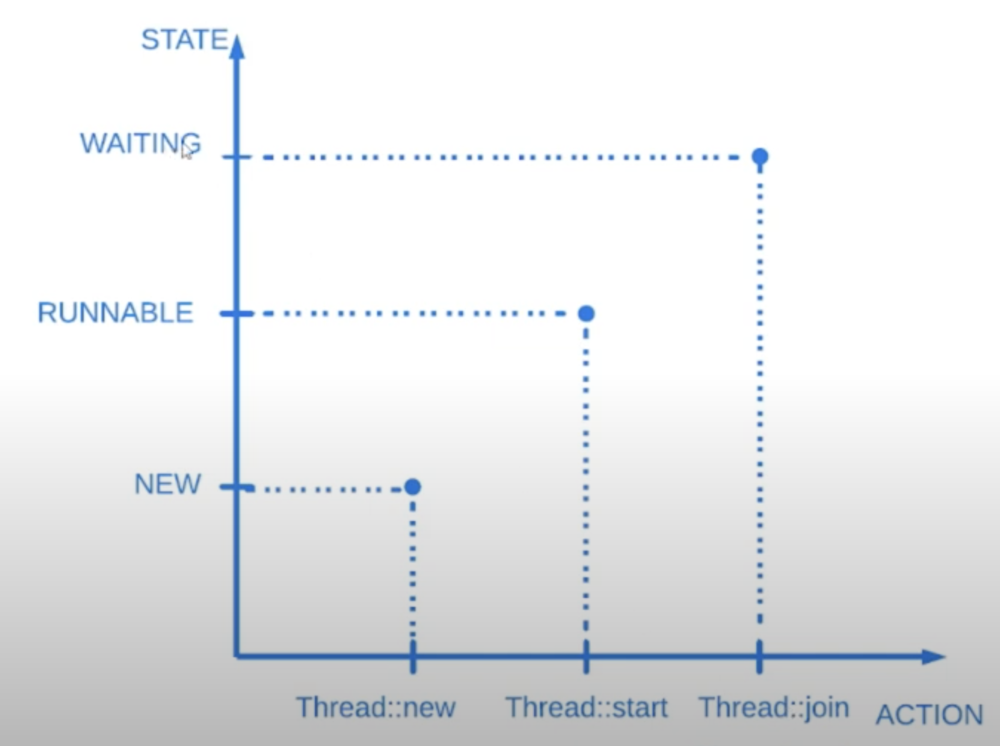
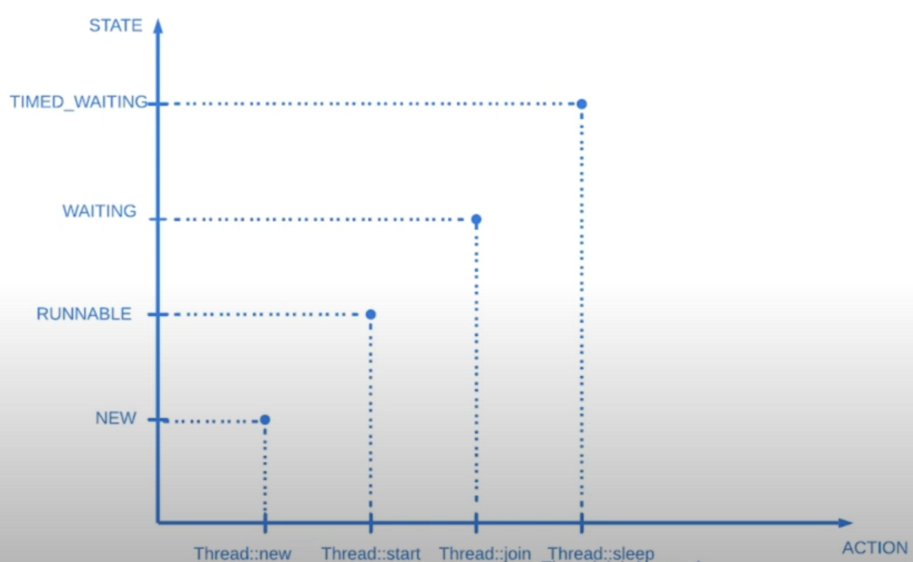
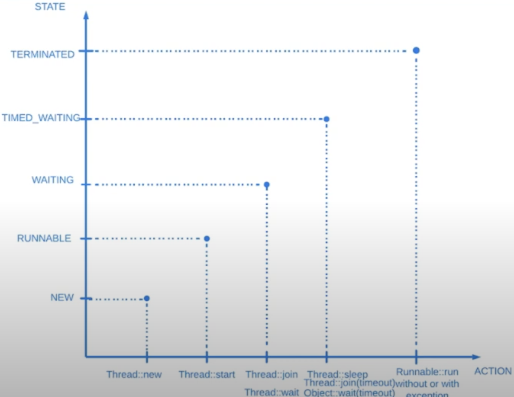

# 7. Состояния потоков

Потоки бывают в следующих состояниях:
* `NEW` (Новый)
* `RUNNABLE` (Исполняемый)
* `BLOCKED` (Блокированный)
* `WAITING` (Ожидающий)
* `TIMED_WAITING` (Временно ожидающий)
* `TERMINATED` (Завершенный)

> В классе `Thread` есть enum `State` с описанием состояния потока. Через метод `getState()` можно получить 
> текущее состояние потока

### 1. NEW

Если поток создан в результате применения оператора new, то потоку присваивается состояние `NEW`. 
Это означает, что поток еще не был запущен на выполнение.


```java
public class Runner {

    public static void main(String[] args) {
      final Thread thread = new Thread(() -> showThreadState(Thread.currentThread()));
      showThreadState(thread);
    }

    private static void showThreadState(final Thread thread) {
        System.out.printf(String.format("%s : %s\n", thread.getName(), thread.getState()));
    }
}
```

Output:
```
Thread-0: NEW
```

### 2. RUNNABLE

Как только поток вызывается (вызывается метод `start()`), то поток оказывается в исполняемом
состоянии.


```java
thread.start();
showThreadState(thread);
```

Output:
```
Thread-0: NEW
Thread-0: RUNNABLE
```

> Метод `start()` может быть вызван, но поток может быть не запущен из-за квантования времени
> При этом в Java нет такого состония, что запущенный поток не выполняется. И так 2 запущенных потока
> будут в состоянии `RUNNABLE`

### 3. BLOCKED

Состояние связано с мониторами, блокировками. Пока что пропустим это состояние.

### 4. WAITING

Состояние связано с методами `wait()`, `join()`. 


```java
public class Runner {

    public static void main(String[] args) throws InterruptedException {
      final Thread mainThread = Thread.currentThread();
      final Thread thread = new Thread(() -> {
         try {
         mainThread.join();
         showThreadState(Thread.currentThread());
        } catch (InterruptedException e) {
             
        }
      });
      thread.start();
      Thread.sleep(1000);
      showThreadState(thread);
    }

    private static void showThreadState(final Thread thread) {
        System.out.printf(String.format("%s : %s\n", thread.getName(), thread.getState()));
    }
}
```

Output:
```
Thread-0: WAITING
Thread-0: RUNNABLE
```

### 5. TIMED_WAITING

Временно ожидающий поток. Состояние возникает при вызовах `sleep()`, `Object::wait(timeout)`, `Thread::join(timeout)`


```java
public class Runner {

    public static void main(String[] args) throws InterruptedException {
      final Thread mainThread = Thread.currentThread();
      final Thread thread = new Thread(() -> {
         try {
         mainThread.join(2000);
         showThreadState(Thread.currentThread());
        } catch (InterruptedException e) {
             
        }
      });
      thread.start();
      Thread.sleep(1000);
      showThreadState(thread);
    }

    private static void showThreadState(final Thread thread) {
        System.out.printf(String.format("%s : %s\n", thread.getName(), thread.getState()));
    }
}
```

Output:
```
Thread-0: TIMED_WAITING
Thread-0: RUNNABLE
```

### 6. TERMINATED

Поток переходит в это состояние при нормальном завершении метода `run()` или из-за не перехваченного исключения.


```java
public class Runner {

    public static void main(String[] args) throws InterruptedException {
      final Thread thread = new Thread(() -> showThreadState(Thread.currentThread()));
      thread.start();
      thread.join();
      showThreadState(thread);
    }

    private static void showThreadState(final Thread thread) {
        System.out.printf(String.format("%s : %s\n", thread.getName(), thread.getState()));
    }
}
```

Output:
```
Thread-0: RUNNABLE
Thread-0: TERMINATED
```