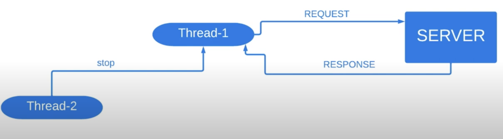

# 8. Прерывания потоков

Поток прерывается (переходит в состояние `TERMINATED`) когда метод `run()` возвращает управление, выполнив
оператор `return` или происходит исключение, которое не перехватывается в данном методе.

Но что делать если нужно прервать выполнение потока до того как выполнится метод `run()` или вызовется исключение?

Предположим, что у нас есть сервер с которым мы коммуницируем в потоке под именем `Thread-1`. Коммуникация происходит
так, что в бесконечном цикле мы отправляем запросы и получаем ответы от сервера. И через некоторое время запускаем
2 поток `Thread-2` который проверяет некоторое условие и если условие правдиво, то он останавливает первый поток. 


### 1. Java.lang.Thread::stop
В Java присутствует метод `stop()`, который можно вызвать из другого потока, чтобы прервать работу текущего. В нашем
случае код бы выглядел примерным образом:


#### Пример
```java
import java.util.concurrent.TimeUnit;

public class Runner {
    private static final String MESSAGE_REQUEST_WAS_SENT = "\nRequest was sent.";
    private static final int DURATION_IN_SECONDS_DELIVERING_RESPONSE = 1;
    private static final String MESSAGE_RESPONSE_WAS_RECEIVED = "Response was received.";
    private static final String MESSAGE_SERVER_WAS_STOPPED = "Server was stopped.";

    public static void main(String[] args) throws InterruptedException {
        final Thread communicatingThread = new Thread(() -> {
            try {
                while (true) {
                    doRequest();
                }
            } catch (InterruptedException e) {
                
            }
        });
        communicatingThread.start();
    
        final Thread stoppingThread = new Thread(() -> {
            if (isServerShouldBeOffed()) {
                communicatingThread.stop();
                System.out.println(MESSAGE_SERVER_WAS_STOPPED);
            }
        });
        TimeUnit.SECONDS.sleep(5);
        stoppingThread.start();
    }

    private static void doRequest() throws InterruptedException {
        System.out.println(MESSAGE_REQUEST_WAS_SENT);
        TimeUnit.SECONDS.sleep(DURATION_IN_SECONDS_DELIVERING_RESPONSE);
        System.out.println(MESSAGE_RESPONSE_WAS_RECEIVED);
    }

    private static boolean isServerShouldBeOffed() {
       return true;
    }
}
```

Здесь сервер может быть выключен вне зависимости от того получен ответ (от сервера) или нет. Например:
```
Request was sent
Server was stopped.
```

Метод `stop()` объявлен устаревшим и его не следует использовать.

### 2. Java.lang.Thread::interrupt
Новый метод для прерывания. Является полем типа `boolean` в классе `Thread` (`interrupted`). Вызов метода необязательно
прерывает исполнение потока. По сути 1 поток просит 2 прерваться, а второй поток сам принимает решение прерываться ли ему.

#### Пример 1
```java
import java.util.concurrent.TimeUnit;

public class Runner {
    private static final String MESSAGE_REQUEST_WAS_SENT = "\nRequest was sent.";
    private static final int DURATION_IN_SECONDS_DELIVERING_RESPONSE = 1;
    private static final String MESSAGE_RESPONSE_WAS_RECEIVED = "Response was received.";
    private static final String MESSAGE_SERVER_WAS_STOPPED = "Server was stopped.";
    private static final String MESSAGE_THREAD_WAS_INTERRUPTED = "Interrupted.";

    public static void main(String[] args) throws InterruptedException {
        final Thread communicatingThread = new Thread(() -> {
            try {
                while (true) {
                    doRequest();
                    if (Thread.currentThread().isInterrupted()) {
                        System.out.println(MESSAGE_THREAD_WAS_INTERRUPTED);
                    }
                }
            } catch (InterruptedException e) {
                
            }
        });
        communicatingThread.start();
    
        final Thread stoppingThread = new Thread(() -> {
            if (isServerShouldBeOffed()) {
                communicatingThread.interrupt();
                System.out.println(MESSAGE_SERVER_WAS_STOPPED);
            }
        });
        TimeUnit.SECONDS.sleep(5);
        stoppingThread.start();
    }

    private static void doRequest() {
        System.out.println(MESSAGE_REQUEST_WAS_SENT);
        System.out.println(MESSAGE_RESPONSE_WAS_RECEIVED);
    }

    private static boolean isServerShouldBeOffed() {
       return true;
    }
}
```

Цикл здесь не прервется. Будет выводиться сообщение о том, что вызван метод `interrupt()`.

#### Пример 2
```java
import java.util.concurrent.TimeUnit;

public class Runner {
    private static final String MESSAGE_REQUEST_WAS_SENT = "\nRequest was sent.";
    private static final int DURATION_IN_SECONDS_DELIVERING_RESPONSE = 1;
    private static final String MESSAGE_RESPONSE_WAS_RECEIVED = "Response was received.";
    private static final String MESSAGE_SERVER_WAS_STOPPED = "Server was stopped.";
    private static final String MESSAGE_THREAD_WAS_INTERRUPTED = "Interrupted.";

    public static void main(String[] args) throws InterruptedException {
        final Thread communicatingThread = new Thread(() -> {
            try {
                while (!Thread.currentThread().isInterrupted()) {
                    doRequest();
                }
            } catch (InterruptedException e) {
                
            }
        });
        communicatingThread.start();
    
        final Thread stoppingThread = new Thread(() -> {
            if (isServerShouldBeOffed()) {
                communicatingThread.interrupt();
                System.out.println(MESSAGE_SERVER_WAS_STOPPED);
            }
        });
        TimeUnit.SECONDS.sleep(5);
        stoppingThread.start();
    }

    private static void doRequest() {
        System.out.println(MESSAGE_REQUEST_WAS_SENT);
        System.out.println(MESSAGE_RESPONSE_WAS_RECEIVED);
    }

    private static boolean isServerShouldBeOffed() {
       return true;
    }
}
```

Здесь все отработает корректно. Но не всегда возможно в потоке определить состояние прерванности, так как
поток может быть заблокирован. Например, операцией запроса на сервер или через `sleep()` и здесь приходит на помощь
`InterruptedException`. Когда вызывается `sleep()` или `wait()` на прерывающемся потоке, то выбрасывается это исключение.

#### Пример 3
```java
import java.util.concurrent.TimeUnit;

public class Runner {
    private static final String MESSAGE_REQUEST_WAS_SENT = "\nRequest was sent.";
    private static final int DURATION_IN_SECONDS_DELIVERING_RESPONSE = 1;
    private static final String MESSAGE_RESPONSE_WAS_RECEIVED = "Response was received.";
    private static final String MESSAGE_SERVER_WAS_STOPPED = "Server was stopped.";
    private static final String MESSAGE_THREAD_WAS_INTERRUPTED = "Interrupted.";

    public static void main(String[] args) throws InterruptedException {
        final Thread communicatingThread = new Thread(() -> {
            try {
                while (!Thread.currentThread().isInterrupted()) {
                    doRequest();
                }
            } catch (InterruptedException e) {
                System.out.println(MESSAGE_THREAD_WAS_INTERRUPTED);
            }
        });
        communicatingThread.start();
    
        final Thread stoppingThread = new Thread(() -> {
            if (isServerShouldBeOffed()) {
                communicatingThread.interrupt();
                System.out.println(MESSAGE_SERVER_WAS_STOPPED);
            }
        });
        TimeUnit.SECONDS.sleep(5);
        stoppingThread.start();
    }

    private static void doRequest() throws InterruptedException {
        System.out.println(MESSAGE_REQUEST_WAS_SENT);
        TimeUnit.SECONDS.sleep(DURATION_IN_SECONDS_DELIVERING_RESPONSE);
        System.out.println(MESSAGE_RESPONSE_WAS_RECEIVED);
    }

    private static boolean isServerShouldBeOffed() {
       return true;
    }
}
```