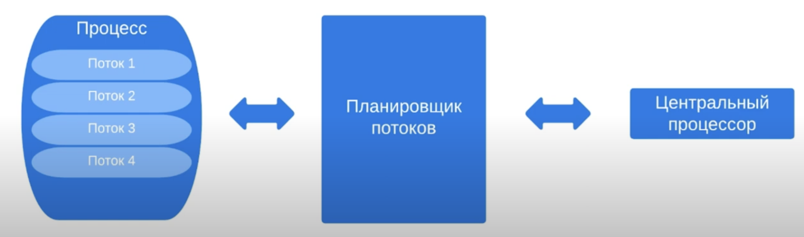
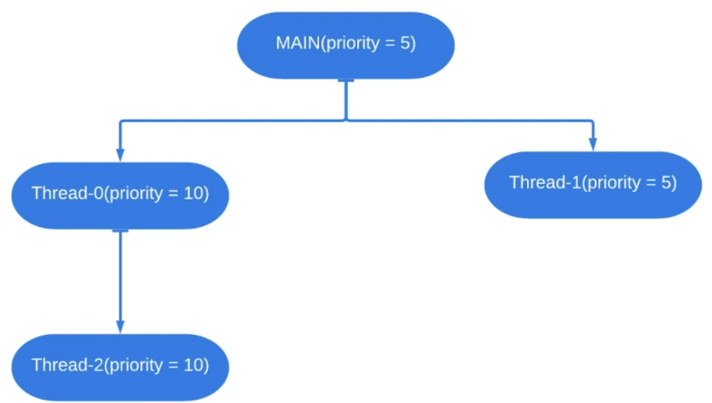

# 9. Приоритеты потоков

В 1 процессе могут выполняться несколько потоков. Эти потоки обрабатываются центральным процессором (ЦП).
ЦП может обрабатывать 1 поток в заданный квант времени. Существует планировщик потоков, который определяет
какой из потоков будет выполняться ЦП в данный квант времени. 

Квантование времени выполнения осуществляется благодаря планировщику потоков. Чтобы понять какой поток будет
выбран следующим (планировщиком) нужно узнать про приоритеты потоков. Приоритеты потоков показывают планировщику насколько
важен этот поток. Если есть несколько потоков ожидающих запуска, то планировщик запустит поток с большим приоритетом. 
Потоки с низким приоритетом запускаются реже (может оказаться так, что они могут вообще не выполниться). В подавляющем
большинстве случаев все потоки должны выполняться с приоритетами по умолчанию.



### JDK реализация
В JDK есть представленные ниже уровни приоритетов потоков:


Можно использовать значения от 1 до 10, однако это мало согласуется с большинством операционных систем. 
Единственным переносимым подходом является использование констант из класса `Thread`. 

Обычному приоритету соответствует значение 5. По умолчанию дочерний поток наследует приоритет родителя.


#### Пример 1
```java
public class Runner {
    private static final String MESSAGE_TEMPLATE = "%s : %d\n";

    public static void main(String[] args) {
        printNameAndPriority(Thread.currentThread());

        Thread.currentThread().setPriority(Thread.MAX_PRIORITY);
        printNameAndPriority(Thread.currentThread());

        Thread thread = new Thread(() -> printNameAndPriority(Thread.currentThread()));
        thread.start();
    }

    private static void printNameAndPriority(Thread thread) {
        System.out.printf(MESSAGE_TEMPLATE, thread.getName(), thread.getPriority());
    }
}
```

```
Output:
main : 5
main : 10
Thread-0 : 10
```

Если поставить значение приоритету больше 10 или меньше 0, то выпадет исключение `IllegalArgumentException`.

Теперь посмотрим, выполнится ли поток с приоритетом 10 раньше, чем поток с приоритетом 5.
#### Пример 2
```java
import java.util.stream.IntStream;

public class Runner {
    private static final String MESSAGE_TEMPLATE = "%s : %d\n";

    public static void main(String[] args) {
        Thread thread = new Thread(new Task());
        thread.setPriority(Thread.MAX_PRIORITY);
        thread.start();
    
        System.out.println("Main thread is finished");
    }

    private static final class Task implements Runnable {
        
        @Override
        public void run() {
            IntStream.range(0, 100).forEach(System.out::println);
        }
    }
}
```

Здесь сначала закончится поток `main`, то есть выведется сначала `Main thread is finished`. И только потом числа от 0 до 99.
Несмотря на то, что приоритет у потока `main` был ниже. Последовательность выполнения зависит от операционной системы.