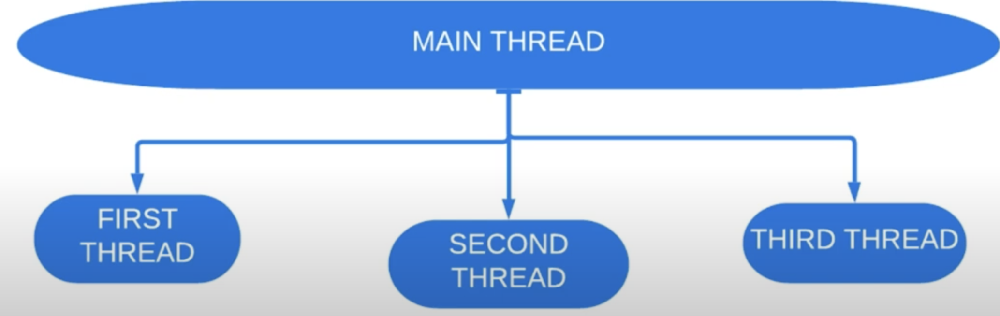

# 10. Потоки-демоны

Поток-демон - это поток, который выполняет некоторую работу в фоновом режиме, пока выполняется программа, но не является
ее активным участником. Таким образом, когда все потоки не демоны завершают свою работу, то программа завершается.
Даже если в программе еще выполняются потоки-демоны. 

Представим, что у нас запущена программа. В процессе работы от потока `main` создается 3 потока. Даже если `main` поток
завершил работу, то программа продолжит выполнять работу 3 потоков. 



В случае если главный поток создал бы потоки-демоны, и поток `main` отработал бы до завершения работы демонов, 
то программа завершилась бы.

> Главный поток не является демоном. В этом можно убедиться с помощью метода `isDaemon()`.

#### Пример 1
```java
import java.util.concurrent.TimeUnit;

public class Runner {

    public static void main(String[] args) {
        Thread thread = new Thread(new Task());
        thread.setDaemon(true);
        thread.start();
    
        System.out.println(thread.isDaemon());
        System.out.println("Main thread is finished");
    }

    private static final class Task implements Runnable {
        
        @Override
        public void run() {
            try {
                while (true) {
                    System.out.println("I am working");
                    TimeUnit.SECONDS.sleep(2);
                }
            } catch (InterruptedException e) {
                Thread.currentThread().interrupt();
            }
        }
    }
}
```

```
Output:

true
I am working
Main thread is finished
```

#### Пример 2
```java
import java.util.concurrent.TimeUnit;

public class Runner {

    private static final String MESSAGE_TEMPLATE = "%s : %b\n";

    public static void main(String[] args) throws InterruptedException {
        final Thread firstDaemonThread = new Thread(() -> {
            printThreadNameAndDaemonStatus(Thread.currentThread());
            Thread secondDaemonThread = new Thread(() -> printThreadNameAndDaemonStatus(Thread.currentThread()));
            secondDaemonThread.start();
            try {
                secondDaemonThread.join();
            } catch (InterruptedException e) {
                Thread.currentThread().interrupt();
            }
        });
        firstDaemonThread.setDaemon(true);
        firstDaemonThread.start();
        
        firstDaemonThread.join();
    }

    private static void printThreadNameAndDaemonStatus(Thread thread) {
        System.out.printf(MESSAGE_TEMPLATE, thread.getName(), thread.isDaemon());
    }   
}
```

```
Output:

Thread-0 : true
Thread-1 : true
```

> Из этого примера становится понятно, что демоничность наследуется :)

> Метод `setDaemon()` должен вызываться до того, как вызовется метод `start()`, иначе выпадет `IllegalStateException`

Поток-демон не должен обращаться к файлам, БД, потому что он может не вызваться даже из блока `finally`.

#### Пример 3
```java
import java.util.concurrent.TimeUnit;

public class Runner {

    private static final String MESSAGE_TEMPLATE = "%s : %b\n";

    public static void main(String[] args) throws InterruptedException {
        Thread thread = new Thread(new Task());
        thread.setDaemon(true);
        thread.start();
    
        TimeUnit.SECONDS.sleep(1);
    }

    private static final class Task implements Runnable {
            
        @Override
        public void run() {
            try {
                System.out.println("I am working");
                TimeUnit.SECONDS.sleep(5);
            } catch (InterruptedException e) {
                Thread.currentThread().interrupt();
            } finally{
                System.out.println("I am finished");
            }
        }
    }  
}
```

```
Output:

I am working
```