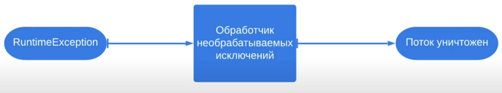

# 11. Обработчики необрабатываемых исключений

Метод `run()` (в интерфейсе `Runnable`) не может генерировать никаких проверяемых исключений, но может быть прерван
необрабатываемым исключением. Когда в методе `run()` выбрасывается необрабатываемое исключение, то поток уничтожается.

Но перед тем как поток уничтожится, исключение передается обработчику. Для написания такого обработчика нужно написать 
свой класс, реализующий `Thread.UncaughtExceptionHandler`. Этот обработчик можно установить в любом потоке. Можно также
установить обработчик для всех потоков.



#### Пример
```java
public class Runner {

    public static void main(String[] args) {
        Thread.UncaughtExceptionHandler handler = (thread, exception) -> {
            System.out.printf("%s : %s", exception.getMessage(), thread.getName());
        };
        Thread thread = new Thread(new Task());
        thread.setUncaughtExceptionHandler(handler);
        thread.start();
    }

    private static final class Task implements Runnable {
        
        @Override
        public void run() {
            throw new RuntimeException("I am exception");
        }
    }
}
```

```
Output:

I am exception : Thread-0
```

> Для того, чтобы установить обработчик на все создаваемые потоки можно использовать статический метод из класса 
> `Thread.setDefaultUncaughtExceptionHandler(handler);`