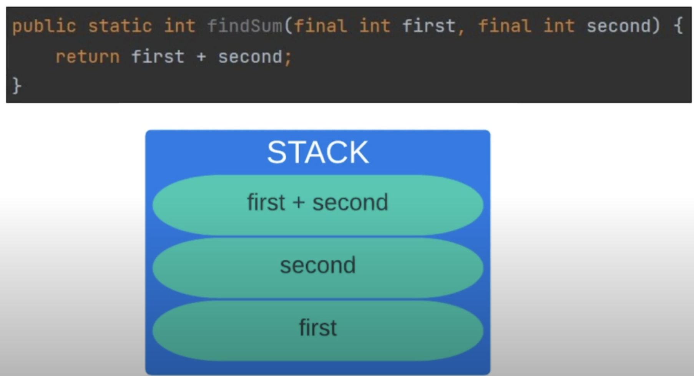
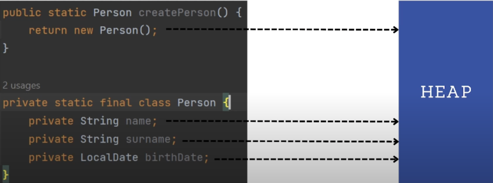
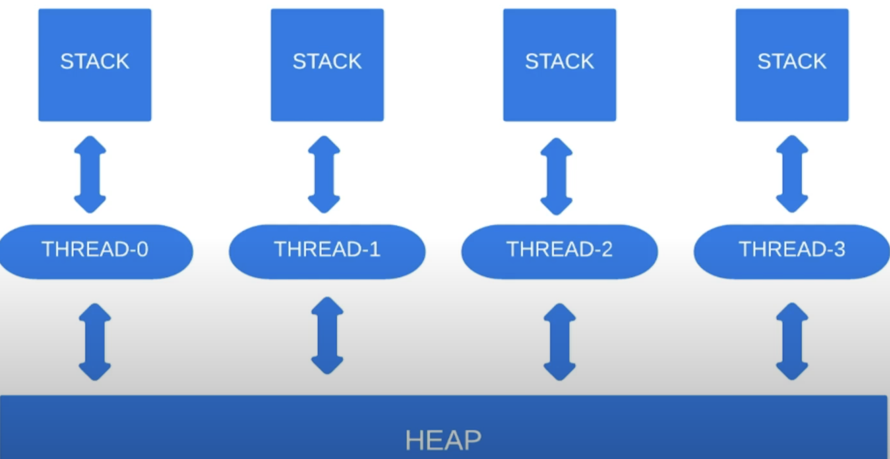

# 13. Синхронизация потоков

Известно, что есть потоки и процессы (см. [1 урок](./01_поток_и_процесс.md)). 
Отличием потока от процесса является то, что несколько потоков работают с общим участком памяти.
При изменении данных 1 потоком возможно повреждение при работе второго потока.

#### Stack VS Heap
Вспомним 2 главных типа памяти: стек и куча. 

В стеке хранятся все локальные переменные и аргументы методов.

В куче хранятся все поля классов и объекты созданные через `new()`.

Стековая память является быстрой, а куча является медленной (доступ к данным занимает больше времени).
Каждый поток имеет свою стековую память, однако потоки взаимодействуют с 1 и той же кучей.

Если несколько потоков начнут параллельно взаимодействовать с некоторым объектом в куче, то этот объект
может быть поврежден. Именно поэтому существует синхронизация.