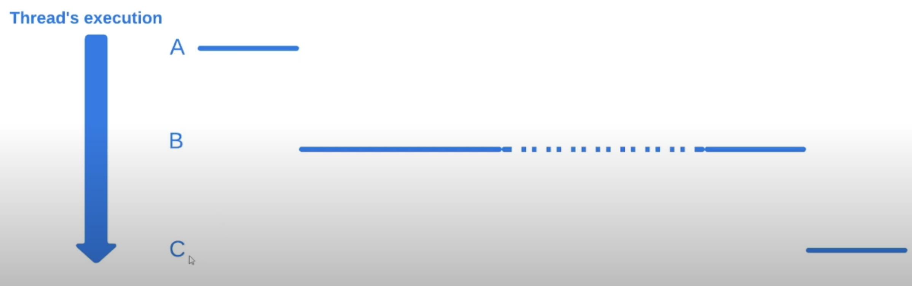
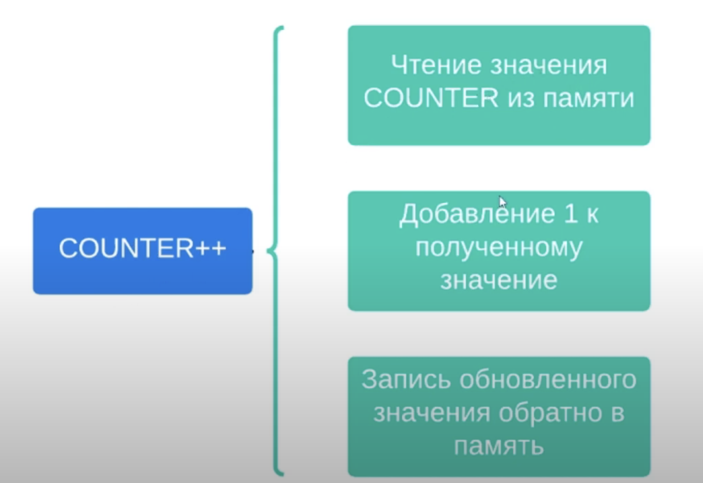
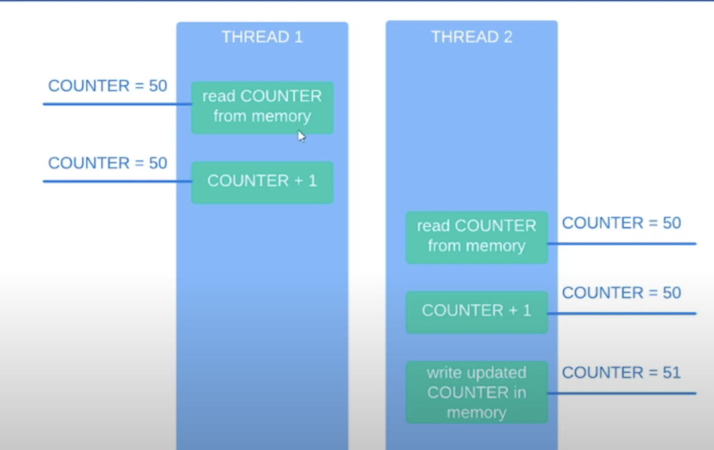

# 14. Пример состояния гонок, атомарные операции

Начнем сразу с примера
```java
public class Runner {

    private static int counter = 0;

    public static void main(String[] args) throws InterruptedException {
        Thread firstThread = createIncrementingCounterThread(500);
        Thread secondThread = createIncrementingCounterThread(600);
        
        firstThread.start();
        secondThread.start();
    
        firstThread.join();
        secondThread.join();

        System.out.println(counter);
    }

    private static Thread createIncrementingCounterThread(int incrementAmount) {
        return new Thread(() -> java.util.stream.IntStream.range(0, incrementAmount).forEach(i -> counter++));
    }
}
```

```
Output:

1093
```

Вывод может быть разным. 1073 или даже правильным (1100). 
Чтобы понять, что пошло не так нужно обсудить атомарные операции.

> Операции A и B являются атомарными если с точки зрения потока выполняющего операцию A, операция B
> либо выполнена целиком другим потоком, либо не выполнена даже частично.

Представим что был запущен поток, которому надо выполнить 3 операции A, B, C. Потоки могут периодически приостанавливаться
планировщиком потоков из-за квантования. Вся суть атомарных операций заключается в том, что планировщик не может прервать
выполнение атомарной операции. Либо поток не начал выполнять атомарную операцию, либо полностью завершил операцию.



На рисунке показаны 2 атомарные операции A и C. Операция B не является атомарной. Она состоит из атомарных операций,
но является составной.

> В Java атомарными операциями являются присваивания со всеми примитивными типами данных (кроме double и long).
> Также атомарной операцией является присваивание ссылок.

Не атомарной операцией в примере является операция инкремента. Данная операция состоит из нескольких шагов.



Возможно такое состояние:



Это называется состоянием гонки.