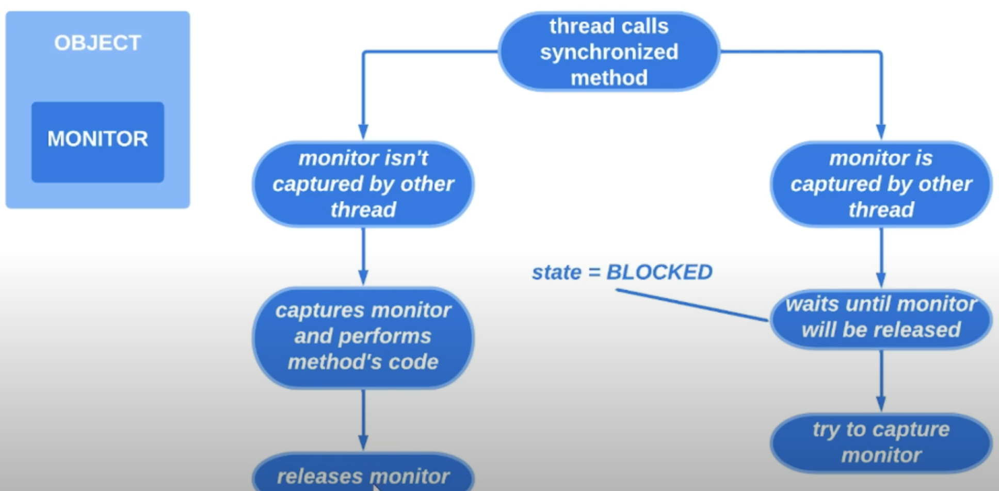
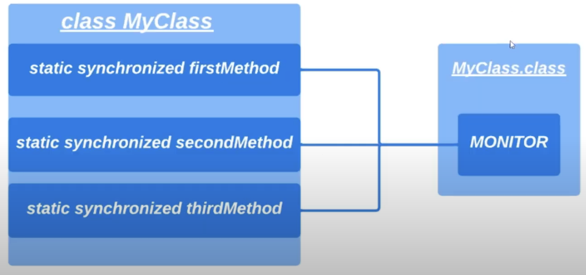
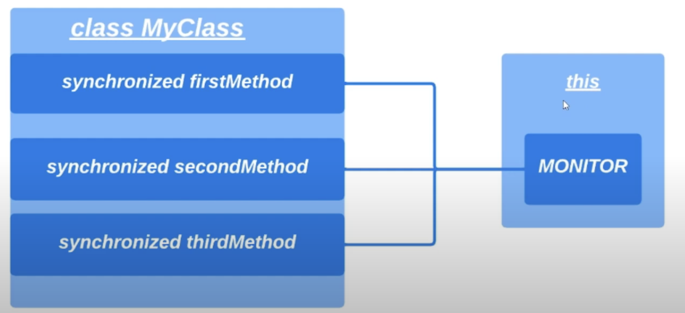

# 16. Synchronized, монитор, синхронизированные блоки

В прошлом уроке была решена проблема состония гонки. Стало ясно, что когда несколько потоков работают
с 1 переменной в куче мы должны синхронизировать их работу с общим ресурсом помощью ключевого слова `synchronized`.
И вынести логику по работе с общим ресурсом в отдельный метод. Чтобы когда 1 поток начал работу остальные потоки ждали
пока первый полностью закончит свою работу.

Что происходит под капотом, когда используется ключевое слово `synchronized`?

Во-первых, нужно рассмотреть понятие монитора. И каждый объект в Java обладает своим монитором (и только 1 монитором). 
И когда какой-то поток пытается вызвать синхронизированный метод он сначала проверяет, был ли захвачен монитор
другим потоком. Если монитор уже захвачен, то поток ждет пока монитор освободит ресурс. Когда монитор освобождается
поток конкурирует с другими потоками за доступ к ресурсу, которые также пытаются получить доступ.

Кстати, в 7 уроке было пропущено состояние потока `BLOCKED`. Как раз в это время когда поток ждет освобождения 
монитора другим потоком наш поток находится в состоянии `BLOCKED`. Если монитор еще не захвачен другим потоком наш
поток захватывает монитор и начинает выполнять код в нашем методе. 

 

Так как в 1 момент времени монитором объекта может владеть только 1 поток, то у нас получается, что синхронизированные
методы может выполнять только 1 поток.

Вызывая статические синхронизированные методы конкурируют за монитор объекта. 

 

В примере из прошлого урока 2 потока конкурировали за монитор класса `Runner.class`. Потому что в этом классе
находится синхронизированный статический метод.

Изменим пример:
```java
import java.util.function.IntConsumer;

public class Runner {
    private static int firstCounter = 0;
    private static int secondCounter = 0;

    public static void main(String[] args) throws InterruptedException {
        Thread firstThread = createIncrementingCounterThread(500, i -> incrementFirstCounter());
        Thread secondThread = createIncrementingCounterThread(500, i -> incrementFirstCounter());

        Thread thirdThread = createIncrementingCounterThread(600, i -> incrementSecondCounter());
        Thread fourthThread = createIncrementingCounterThread(600, i -> incrementSecondCounter());
        
        firstThread.start();
        secondThread.start();
        thirdThread.start();
        fourthThread.start();
    
        firstThread.join();
        secondThread.join();
        thirdThread.join();
        fourthThread.join();

        System.out.println(firstCounter);
        System.out.println(secondCounter);
    }

    private static Thread createIncrementingCounterThread(int incrementFirstCounter, IntConsumer incrementingOperation) {
        return new Thread(() -> java.util.stream.IntStream.range(0, incrementAmount).forEach(incrementingOperation));
    }
    
    public static synchronized void incrementFirstCounter() {
        firstCounter++;
    }

    public static synchronized void incrementSecondCounter() {
        secondCounter++;
    }
}
```

```
Output:

1000
1200
```

> В случае когда потоки не конкурируют за общий ресурс использовать `synchronized` может быть излишне плюс трудозатратно.
> Особенно в статических методах когда потоки блокируются на монитор объекта класса. 

В данном примере инкрементация 1 счетчика не зависит от 2 счетчика. Как можно синхиронизировать работу первых двух
потоков и работу третьего с четвертым потоков? Можно использовать блок синхронизации, который выглядит как:
```java
public static void incrementCounter() {
    synchronized(object) {
        counter++;
    }
    // other code
}
```

В блоке синхронизации можно указывать объект по монитору которого будет выполняться синхронизация.
Это необязательно должен быть объект класса, где находится наш статический метод. 

Также можно синхронизировать не весь метод целиком. Потому что мы должны стремиться к тому, чтобы количество
синхронизированного кода было минимальным (потому что синхронизация не бесплатна).

Обновим пример:
```java
import java.util.function.IntConsumer;

public class Runner {
    private static int firstCounter = 0;
    private static int secondCounter = 0;

    private static final Object LOCK_FIRST_COUNTER = new Object();
    private static final Object LOCK_SECOND_COUNTER = new Object();

    public static void main(String[] args) throws InterruptedException {
        Thread firstThread = createIncrementingCounterThread(500, i -> incrementFirstCounter());
        Thread secondThread = createIncrementingCounterThread(500, i -> incrementFirstCounter());

        Thread thirdThread = createIncrementingCounterThread(600, i -> incrementSecondCounter());
        Thread fourthThread = createIncrementingCounterThread(600, i -> incrementSecondCounter());
        
        firstThread.start();
        secondThread.start();
        thirdThread.start();
        fourthThread.start();
    
        firstThread.join();
        secondThread.join();
        thirdThread.join();
        fourthThread.join();

        System.out.println(firstCounter);
        System.out.println(secondCounter);
    }

    private static Thread createIncrementingCounterThread(int incrementFirstCounter, IntConsumer incrementingOperation) {
        return new Thread(() -> java.util.stream.IntStream.range(0, incrementAmount).forEach(incrementingOperation));
    }
    
    public static void incrementFirstCounter() {
        synchronized (LOCK_FIRST_COUNTER) {
            firstCounter++;
        }
    }

    public static void incrementSecondCounter() {
        synchronized (LOCK_SECOND_COUNTER) {
            secondCounter++;
        }
    }
}
```

```
Output:

1000
1200
```

Рассмотрим пример синхронизированного не статического метода. По какому монитору будут синхронизироваться потоки?
Будут синхронизироваться по `this`.



Определим класс `Counter`:

```java
public class Runner {

    private static final Object LOCK_FIRST_COUNTER = new Object();
    private static final Object LOCK_SECOND_COUNTER = new Object();

    public static void main(String[] args) throws InterruptedException {
        Counter firstCounter = new Counter();
        Counter secondCounter = new Counter();

        Thread firstThread = createIncrementingCounterThread(500, i -> firstCounter.increment());
        Thread secondThread = createIncrementingCounterThread(500, i -> firstCounter.increment());

        Thread thirdThread = createIncrementingCounterThread(600, i -> secondCounter.increment());
        Thread fourthThread = createIncrementingCounterThread(600, i -> secondCounter.counter());
        
        firstThread.start();
        secondThread.start();
        thirdThread.start();
        fourthThread.start();
    
        firstThread.join();
        secondThread.join();
        thirdThread.join();
        fourthThread.join();

        System.out.println(firstCounter.counter);
        System.out.println(secondCounter.counter);
    }

    private static final class Counter {
        private int counter;

        public synchronized void increment() {
            this.counter++;
        }   
    }

    private static Thread createIncrementingCounterThread(int incrementFirstCounter, IntConsumer incrementingOperation) {
        return new Thread(() -> java.util.stream.IntStream.range(0, incrementAmount).forEach(incrementingOperation));
    }
    
    public static void incrementFirstCounter() {
        synchronized (LOCK_FIRST_COUNTER) {
            firstCounter++;
        }
    }

    public static void incrementSecondCounter() {
        synchronized (LOCK_SECOND_COUNTER) {
            secondCounter++;
        }
    }
}
```

```
Output:

1000
1200
```