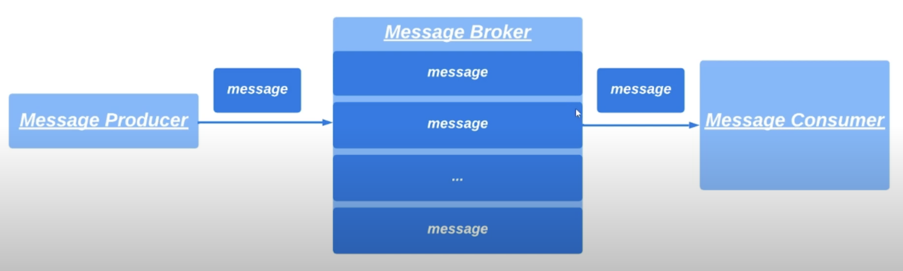
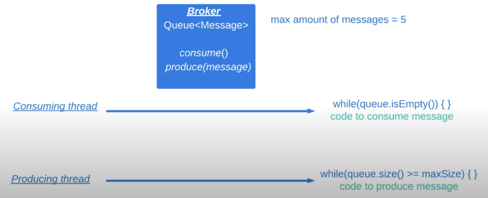
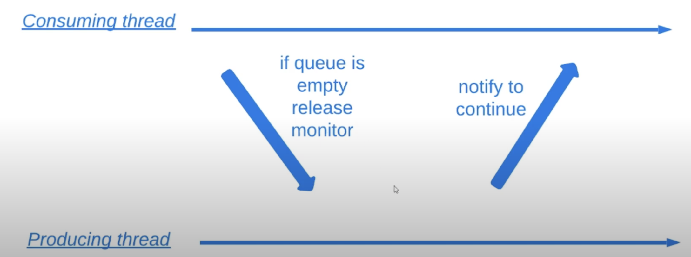
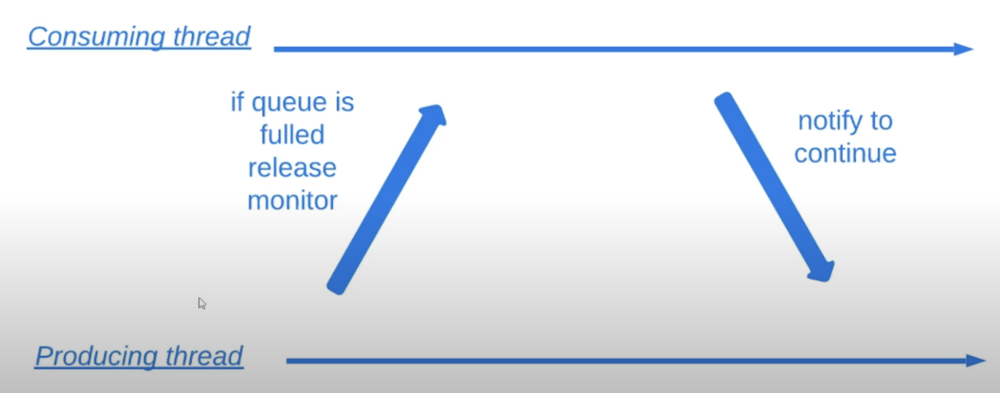
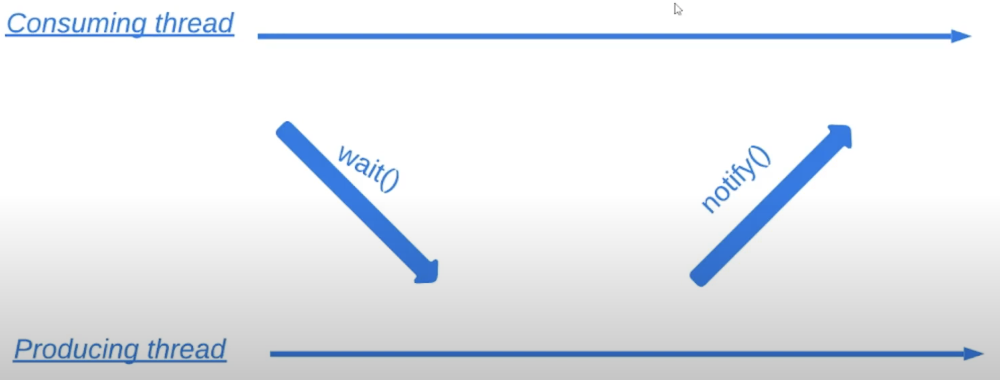
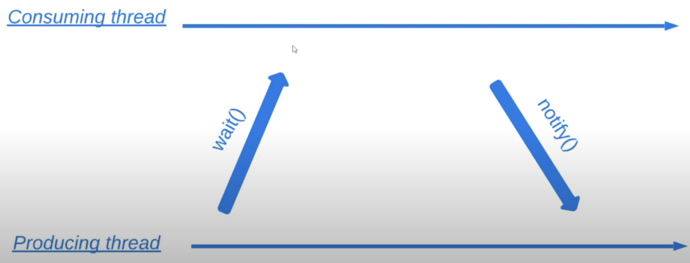

# 17. Методы wait и notify

Допустим, что наша задача разработать программу `MessageProducer`, которая будет передавать сообщения в 
`MessageBroker`. Брокер будет складировать сообщения от продюсера. Также будет `MessageConsumer`, который 
будет потреблять сообщения от брокера и удалять их. 

 

Давайте пока задумаемся, как бы мы это написали. Должно быть запущено 2 потока: `Consuming Thread`, который потребляет
сообщения из брокера и `Producing Thread`, который закидывает сообщения в брокер. Добавим ограничение: максимальное
количество сообщений которые можно хранить в брокере равняется 5. Так как 2 потока одновременно работают с очередью
сообщений брокера, то работу этих потоков надо синхронизировать. У нас будет 2 нестатических метода у брокера:
`consume()` и `produce(message)`. Эти 2 метода будут синхронизированными. То есть мы будем синхронизироваться по монитору
экземпляра класса брокера. 



> Пример реализации доступен [здесь](../examples/17/src/Main.java).

Если мы добавим изначально проверку в брокере (в `consume()`), что очередь не пустая, например:
```java
while (this.messages.isEmpty()) {
    // do nothing
}
```

То программа зависнет, так как продюсер не сможет захватить монитор.

Аналогичное зависание и для продюсера (в `produce()`) при проверке на наличие максимального объема:
```java
while (this.message.size() >= maxStoredMessages) {
    // do nothing
}
```

Хотим иметь следующее поведение для брокера:





Такого поведения можно добиться с помощью `wait()` и `notify()`:




> Поиграйтесь с временем сна в продюсере и консюмере

Методы `wait()` и `notify()` могут вызываться только внутри синхронизированных методов и блоков. 