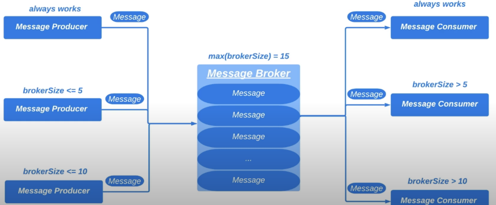
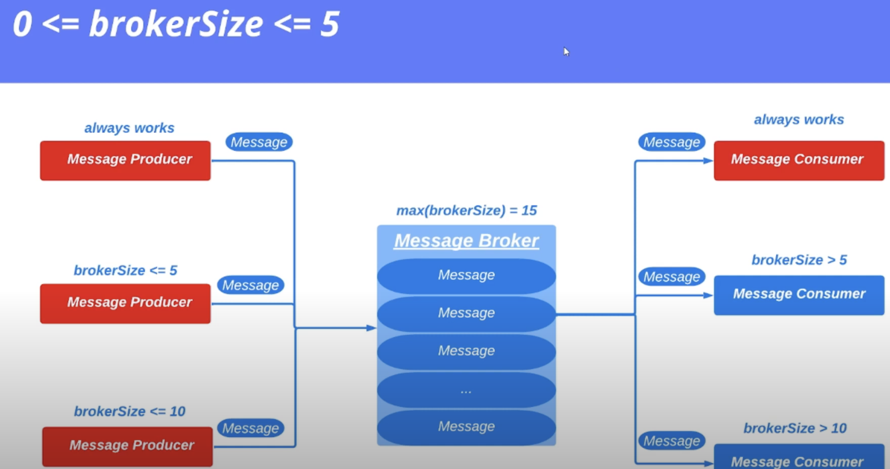
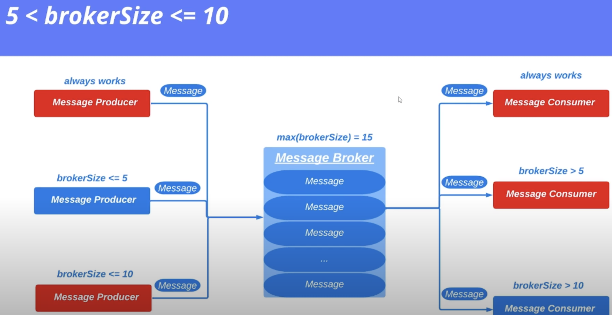
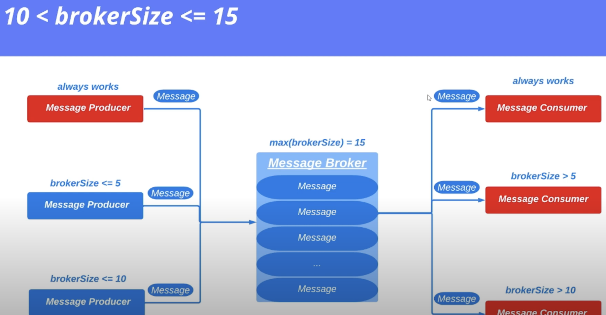

# 18. Практика

Продолжим написание программы с прошлого урока ([ссылка](./17_wait_notify.md)). 

Усложним задачу для брокера. В него параллельно будут писать сообщения 3 продюсера. И также параллельно будут их
потреблять 3 консьюмера. Максимальное количество сообщений будет 15. 

 

Условия по загруженности брокера будут следующими:

* 1 условие:
 
* 2 условие:
 
* 3 условие:

> Пример реализации доступен [здесь](../examples/18/src/Main.java).