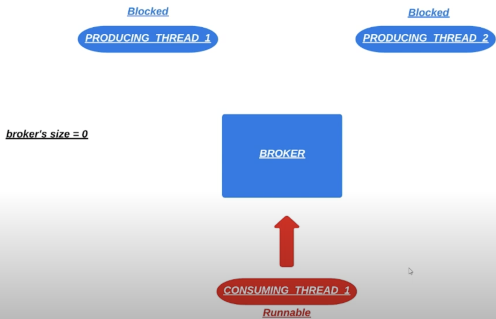
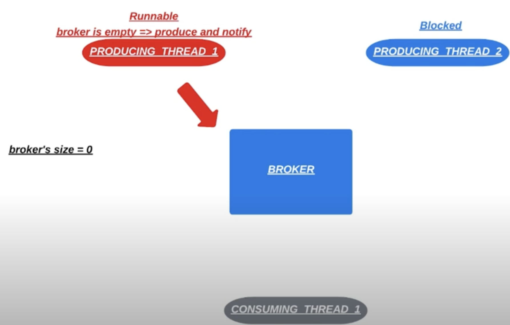
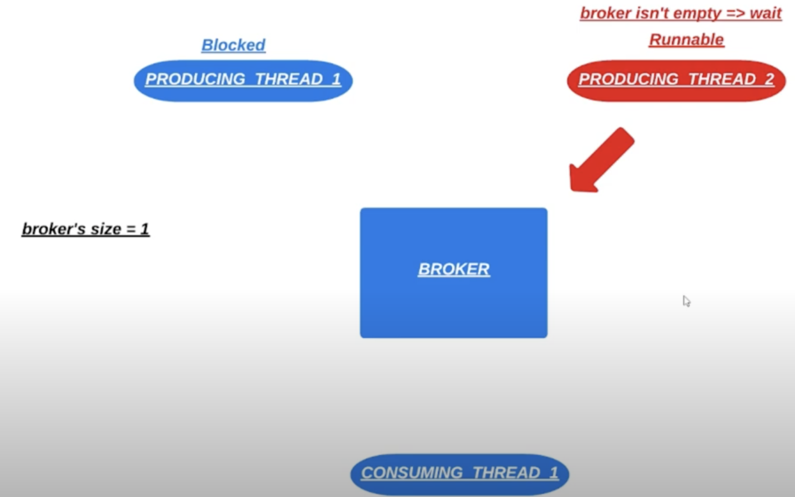
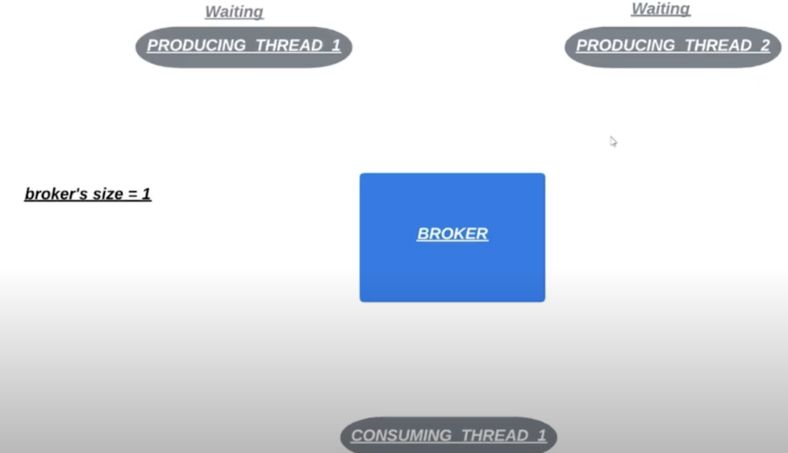
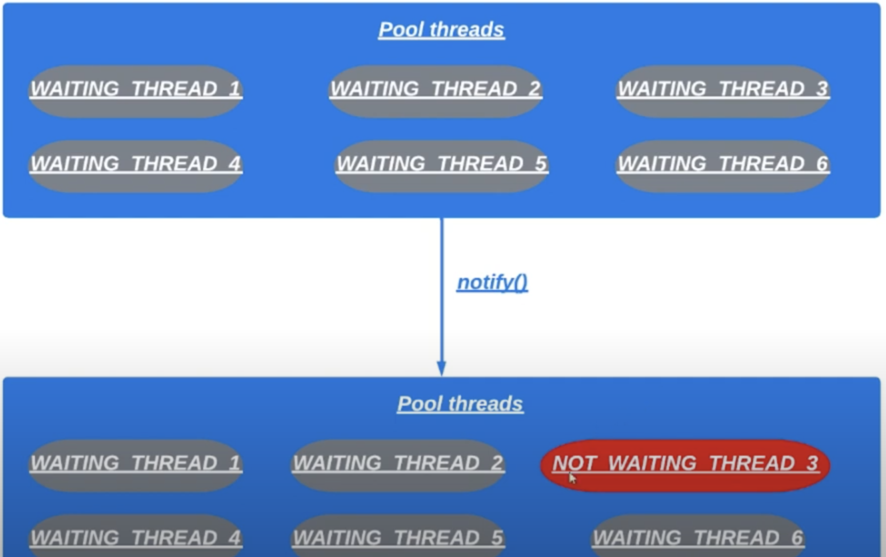
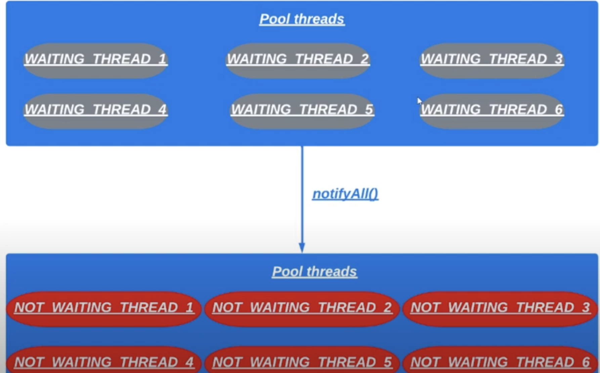

# 19. Метод `notifyAll()`

Методы `notify/notifyAll` можно вызвать у объекта-монитора и только, когда этот монитор занят 
– т.е. внутри блока `synchronized`. 
Метод `notifyAll` снимает с паузы все нити, которые стали на паузу с помощью данного объекта-монитора.

> После вызова `notify()` в синхронизированном методе поток который владеет монитором объекта тут же не освобождает
> этот монитор. После вызова метода `notify()` у нас бы мог исполняться другой код. Который текущий поток выполнял, 
> держа заблокированным монитор текущего объекта. `notify()` лишь уведомляет поток, который ранее вызвал метод 
> `wait()`, что после того как вызовется метод `notify()` освободит заблокированный монитор он может начать 
> конкурировать за монитор с другими потоками, чтобы продолжать работу с того места где был вызван метод `wait()`.

Рассматривая пример с предыдущего урока упростим проверку в консьюмере и продюсере. Пусть для метода `consume()`
будет единственная проверка что очередь не пустая, а для `produce()` что в очереди не больше заданного количества
сообщений. У нас будет только 2 потока продюсера и 1 консумер. 
Сделаем так, чтобы в брокере хранилось максимум 1 сообщение. Уберем `sleep()` из методов `run()` (тасок).
Программа в таком случае зависнет. 

Разберемся в чем дело:
1. Пусть у нас первым захватил монитор брокера поток `CONSUMING_THREAD_1`. Он увидел что в брокере нет сообщений
и вызвал `wait()`. Теперь он ожидает когда другой поток вызовет `notify()`. 

2. Поток консюмера находится в ожидании. Пусть захватил монитор поток `PRODUCING_THREAD_1`. Он увидел что очередь пуста
и положил в нее сообщение. Вызвал метод `notify()`. Так проснется только 1 рандомный поток, который до этого вызывал
метод `wait()`. И сейчас ожидает вызова метода `notify()`. У нас сейчас ожидает только 1 поток консюмера. Таким
образом мы разбудим поток консьюмера.

3. Теперь монитор брокера снова захватил консьюмер. Он увидел что в очереди есть сообщение. Он его потребил
и освободил монитор. 
4. 1 продюсер поток снова захватил монитор и положил сообщение в очередь. 
5. Теперь монитор захватил `PROCUDING_THREAD_2`. Он увидел что в брокере есть сообщение. Вызвал метод `wait()`.
И теперь ожидает вызова `notify()` на брокере. 

6. Теперь монитор захватил `PROCUDING_THREAD_1`. Он увидел что в брокере есть сообщение. Вызвал метод `wait()`.
И теперь ожидает вызова `notify()` на брокере.
7. Отработал консюмер, потребил сообщение и вызвал метод `notify()`. Из-за вызова метода `notify()` проснулся
`PROCUDING_THREAD_1`. Допустим, что снова отработал консюмер, увидел что сообщений нет и вызвал `wait()`
8. `PROCUDING_THREAD_1` кладет сообщение в брокер, вызывает `notify()`. Просыпается `PROCUDING_THREAD_2`. Очередь
не пустая, вызывает метод `wait()`.
9. `PROCUDING_THREAD_1` перехватывает монитор. Очередь не пустая. Брокер завис

В конечном итоге все потоки в состоянии `WAITING`. Вызвать метод `notify()` для них больше некому. 

> Чтобы решить проблему можно использовать `notifyAll()`.

Допустим у нас есть 6 потоков. При вызове `notify()` проснется только 1 поток.

А при `notifyAll()` проснутся все 6.

