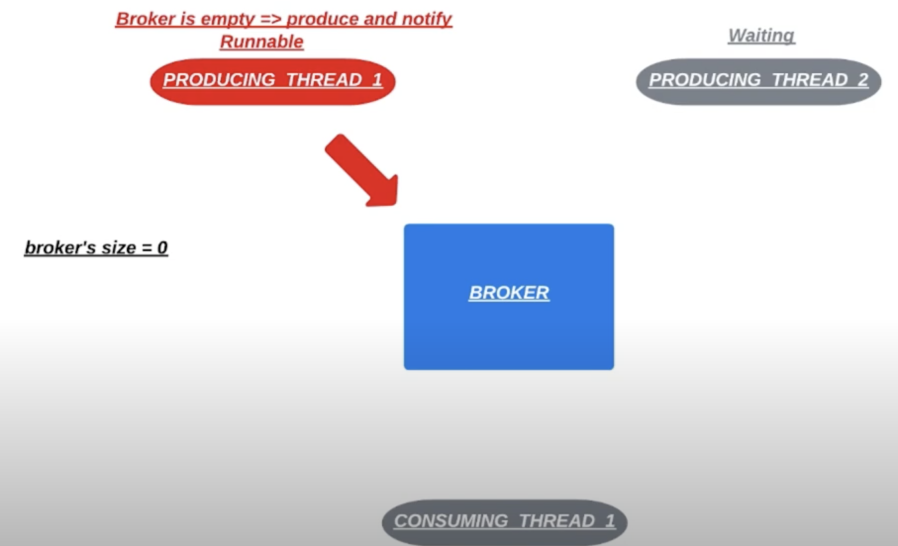
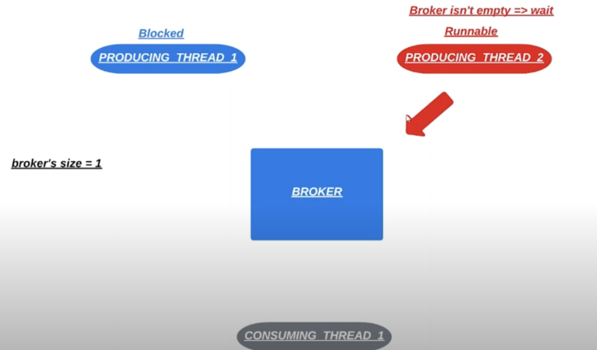

# 20. Завершающий урок по `synchronized`

На примере брокера из прошлых уроков можно задаться вопросом: почему мы вызываем метод `wait()` внутри 
цикла `while`? Почему не вызывать `if`? 

Представим, что брокер находится в таком состоянии:

И после этого перейдет в такое состояние:

Если бы был задействован `if`, то после работы 1 продюсера 2 не стал бы проверять `if` а сразу начал выполняться.
И положил бы 2 сообщение в брокер. Нарушалась бы логика.

В классе `Object` существует перегруженная версия `wait(long timeoutMillis)` которая принимает 
количество миллисекунд в параметре. Параметр означает сколько мы готовы максимально ждать вызов метода `notify()`.

Работает также как `wait()` без параметров, но в случае без таймаута мы ждем пока не будет вызван `notify()`.
В случае с перегруженным вариантом, когда время истечет и другие методы так и не вызвали `notify()` поток
который вызвал `wait(long timeoutMillis)` продолжит конкурировать за монитор с другими потоками, чтобы продолжить
свою работу. 

Поскольку у нас возможна ситуация, когда все 3 потока в брокере будут в состоянии `waiting()`. Эта проблема решается
с помощью `notifyAll()`. Но эта проблема также решается через `wait(long timeoutMillis)`.
Даже когда все потоки будут в состоянии `TIMED_WAITING` потоки через некоторое время проснутся. 