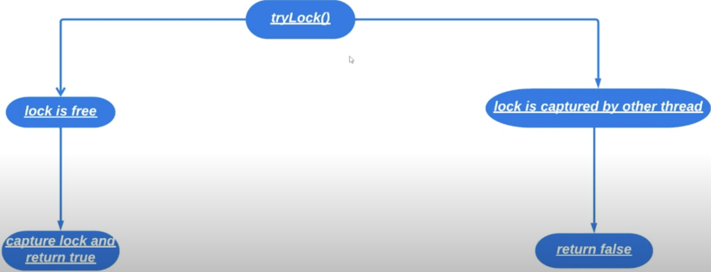
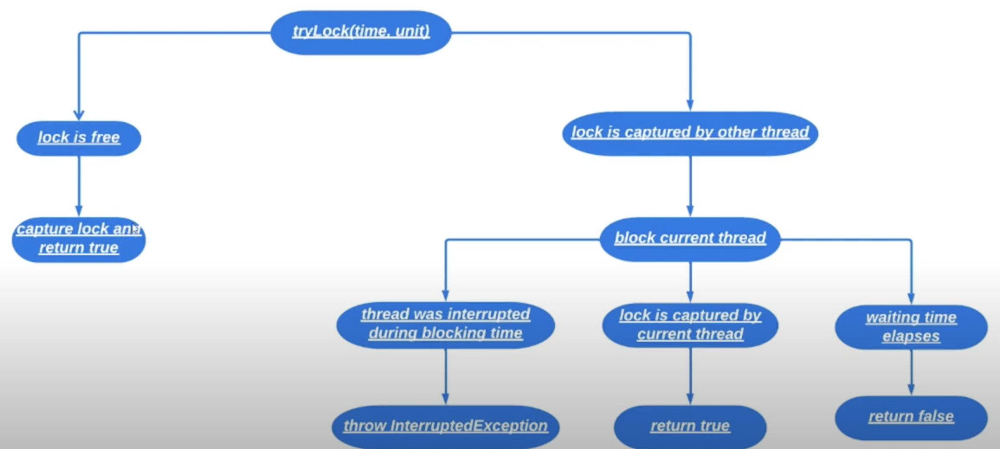

# 22. Дополнительные возможности явных блокировок

Мы уже рассмотрели методы `lock()` и `unlock()`. Хотелось бы отметить, что нежелательно использовать 
блокировки, когда их можно заменить 1 `synchronized`.

Не следует использовать явные блокировки без явных причин. Причины следующие:
* Когда нужно в 1 методе захватить блокировку, а в каком-нибудь другом освободить. Ключевое слово
`synchronized` не поможет, т.к. синхронизированные блоки находятся внутри одного метода. 
```java
public void firstMethod(object) {
    this.lock.lock();
}

public void secondMethod(object) {
    this.lock.unlock();
}
```

#### Пример 1
```java
import java.util.concurrent.locks.Lock;
import java.util.concurrent.locks.ReentrantLock;
import java.util.function.IntConsumer;
import java.util.stream.IntStream;

public class Runner {

    public static void main(String [] args) throws InterruptedException {
        Counter counter = new Counter();

        Thread incrementThread = new Thread(createTask(counter, i -> counter.increment(), 10));
        Thread decrementThread = new Thread(createTask(counter, i -> counter.decrement(), 5));

        incrementThread.start();
        decrementThread.start();

        incrementThread.join();
        decrementThread.join();
    
        System.out.println(counter.getValue());
    }

    private static Runnable createTask(Counter counter, IntConsumer operation, int times) {
        return () -> {
            counter.lock();
            try {
                IntStream.range(0, times).forEach(operation);
            } finally{
                counter.unlock();
            }
        };
    }

    private static class Counter {

        private final Lock lock = new ReentrantLock();

        private int value;        

        public void lock() {
            this.lock.lock();
            printMessage("Thread %s locked counter\n");
        }

        public void unlock() {
            printMessage("Thread %s is unlocking counter\n");
            this.lock.unlock();
        }

        public int getValue() {
            return this.value;
        }

        public void increment() {
            this.value++;
            printMessage("Thread %s increment counter\n");
        }

        public void decrement() {
            this.value--;
            printMessage("Thread %s decrement counter\n");
        }

        private static void printMessage(String message) {
            System.out.printf(message, Thread.currentThread().getName());
        }
    }
}
```

```
Output:

Thread Thread-1 locked counter
Thread Thread-1 decrement counter
Thread Thread-1 decrement counter
Thread Thread-1 decrement counter
Thread Thread-1 decrement counter
Thread Thread-1 decrement counter
Thread Thread-1 is unlocking counter
Thread Thread-0 locked counter
Thread Thread-0 increment counter
Thread Thread-0 increment counter
Thread Thread-0 increment counter
Thread Thread-0 increment counter
Thread Thread-0 increment counter
Thread Thread-0 increment counter
Thread Thread-0 increment counter
Thread Thread-0 increment counter
Thread Thread-0 increment counter
Thread Thread-0 increment counter
Thread Thread-0 is unlocking counter
5
```

* При создании экземпляра класса `ReentrantLock` можно передать параметр `fairness` в конструктор.
```java
new ReentrantLock();  => fairness = false
new ReentrantLock(false);  => fairness = false
new ReentrantLock(true);  => fairness = true
```

Если мы передаем в качестве параметра `true`, то поток который больше всего ждет захвата блокировки, захватит
эту блокировку. Если `fairness = false`, то невозможно предсказать какой поток захватит монитор.

* Если мы не хотим блокироваться в точке захвата блокировки, если она уже захвачена другим потоком в интерфейсе
`Lock` есть метод `tryLock()`. Это неблокирующий аналог метода `lock()`. 


Обновим генератор четных чисел с прошлого урока, чтобы рассмотреть работу метода `tryLock()`.

#### Пример 2
```java
import java.util.concurrent.locks.Lock;
import java.util.concurrent.locks.ReentrantLock;
import java.util.stream.IntStream;

public class Runner {
    public static void main(String[] args) {
        EvenNumberGenerator evenNumberGenerator = new EvenNumberGenerator();
        Runnable generatingTask = () -> IntStream.range(0, 100).forEach(i -> System.out.println(evenNumberGenerator.generate()));
        
        Thread firstThread = new Thread(generatingTask);
        firstThread.start();

        Thread secondThread = new Thread(generatingTask);
        secondThread.start();

        Thread thirdThread = new Thread(generatingTask);
        thirdThread.start();
    }

    private static final class EvenNumberGenerator {
        
        private final Lock lock;

        private int previousGenetated;

        public EvenNumberGenerator() {
            this.previousGenetated = -2;
            this.lock = new ReentrantLock();
        }

        public int generate() {
            return this.lock.tryLock() 
                ? onSuccessLock()
                : onFailureLock();
        }

        private int onSuccessLock() {
            this.lock.lock();
            try {
                return this.previousGenetated += 2;
            } finally {
                this.lock.unlock();
            }
        }
        
        private int onFailureLock() {
            System.out.printf("Thread %s dont acquire lock", Thread.currentThread().getName());
            throw new RuntimeException();
        }
    }
}
```

```
Output:

Thread Thread-1 dont acquire lockException in thread "Thread-1" 0
2
4
6
Thread Thread-0 dont acquire lockjava.lang.RuntimeException
8
10
12
```

* Также есть перегруженный метод `boolean tryLock(long time, TimeUnit unit) throws InterruptedException`


* И есть метод `lockInterruptibly()`, который можно прервать когда он захватил блокировку (когда вызываем
обычный метод `lock()` то блокировку прервать не получится).