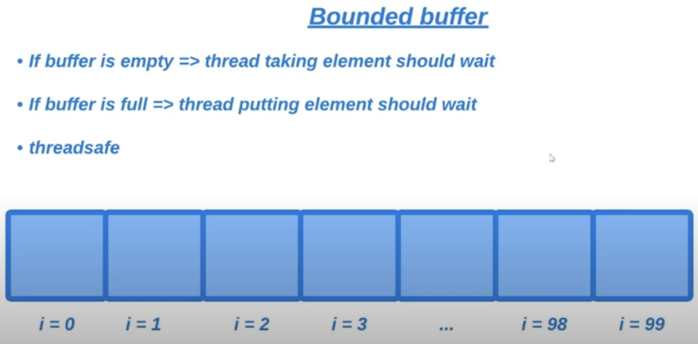

# 23. Condition

Рассмотрим интерфейс `Condition` из пакета `java.util.concurrent.locks`.

Начнем с постановки задачи: реализовать класс `BoundedBuffer` экземпляры которого будут представлять собой коллекцию.
Коллекция ограничена (емкость задается). Работа с экземплярами класса должна быть потокобезопасна. Когда пытаемся
достать элемент из пустого буффера поток должен ждать появления элемента в коллекции. Если какой-то поток пытается
положить элемент в полный буфер, то поток должен ждать пока не появится свободное место. Доступ к элементам осуществляется
по принципу LIFO.

> Пример реализации доступен [здесь](../examples/23/src/Main.java).
>
> Поиграйтесь с TimeUnit.SECONDS.sleep в Main классе