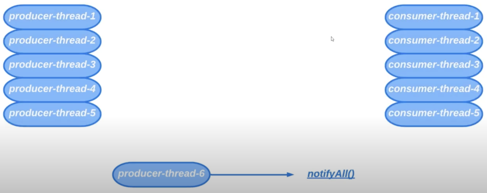

# 24. Дополнительные возможности Condition

Преимущества использования `Condition`:
* Можно иметь столько экземпляров `Condition` сколько нужно
```java
Lock lock = new ReentrantLock();

Condition firstCondition = this.lock.newCondition();
Condition secondCondition = this.lock.newCondition();
```

Рассмотрим пример из прошлого урока. Допустим, что мы писали бы BoundedBuffer с использованием `wait()` и `notify()`.

Было запущено несколько потоков продюсеров и консьюмеров. Предположим что программа поработала и в момент времени
есть 5 потоков продюсеров и 5 потоков консьюмеров. Пусть отрабатывает `producing-thread-6` и вызывает `notifyAll()`.
Тогда все потоки из состояния `WAITING` просыпаются и пытаются захватить монитор. 


Хотя хорошо бы было сделать так, чтобы потоки продюсера будили только потоки консьюмера и наоборот.
Имея несколько экземпляров `Condition` можно добиться такого поведения.


Можно даже использовать `signal()`, а не `signalAll()`. 

Обновленная версия BoundedBuffer будет следующей:
```java
import java.util.Arrays;
import java.util.concurrent.locks.Condition;
import java.util.concurrent.locks.Lock;
import java.util.concurrent.locks.ReentrantLock;

public class BoundedBuffer<T> {

    private final T[] elements;
    private int size;

    private final Lock lock;
    private final Condition notFull;
    private final Condition notEmpty;

    public BoundedBuffer(int capacity) {
        this.elements = (T[]) new Object[capacity];
        this.lock = new ReentrantLock();

        this.notFull = this.lock.newCondition();
        this.notEmpty = this.lock.newCondition();
    }

    public boolean isFull() {
        this.lock.lock();
        try {
            return this.size == this.elements.length;
        } finally {
            this.lock.unlock();
        }
    }

    public boolean isEmpty() {
        this.lock.lock();
        try {
            return this.size == 0;
        } finally {
            this.lock.unlock();
        }
    }

    public void put(T element) {
        this.lock.lock();
        try {
            while (this.isFull()) {
                this.notFull.await();
            }
            this.elements[this.size] = element;
            this.size++;
            System.out.println(element + " was put in buffer. Result buffer: " + this);
            this.notEmpty.signal();
        } catch (InterruptedException e) {
            Thread.currentThread().interrupt();
        } finally {
            this.lock.unlock();
        }
    }

    public T take() {
        this.lock.lock();
        try {
            while (this.isEmpty()) {
                this.notEmpty.await();
            }
            T result = this.elements[this.size - 1];
            this.elements[this.size - 1] = null;
            this.size--;
            System.out.println(result + " was take from buffer. Result buffer: " + this);
            this.notFull.signal();
            return result;
        } catch (InterruptedException e) {
            Thread.currentThread().interrupt();
            throw new RuntimeException(e);
        } finally {
            this.lock.unlock();
        }
    }

    @Override
    public String toString() {
        this.lock.lock();
        try {
            return "BoundedBuffer{" +
                    "elements=" + Arrays.toString(elements) +
                    ", size=" + size +
                    '}';
        } finally {
            this.lock.unlock();
        }
    }
}
```

* Также в `Condition` есть метод `void awaitUninterruptibly();`. Этот метод не выбрасывает `InterruptedException`
в отличие от метода `await()`

* Есть методы которые принимают максимальное время ожидания (`await (long nanosTimeout)`)