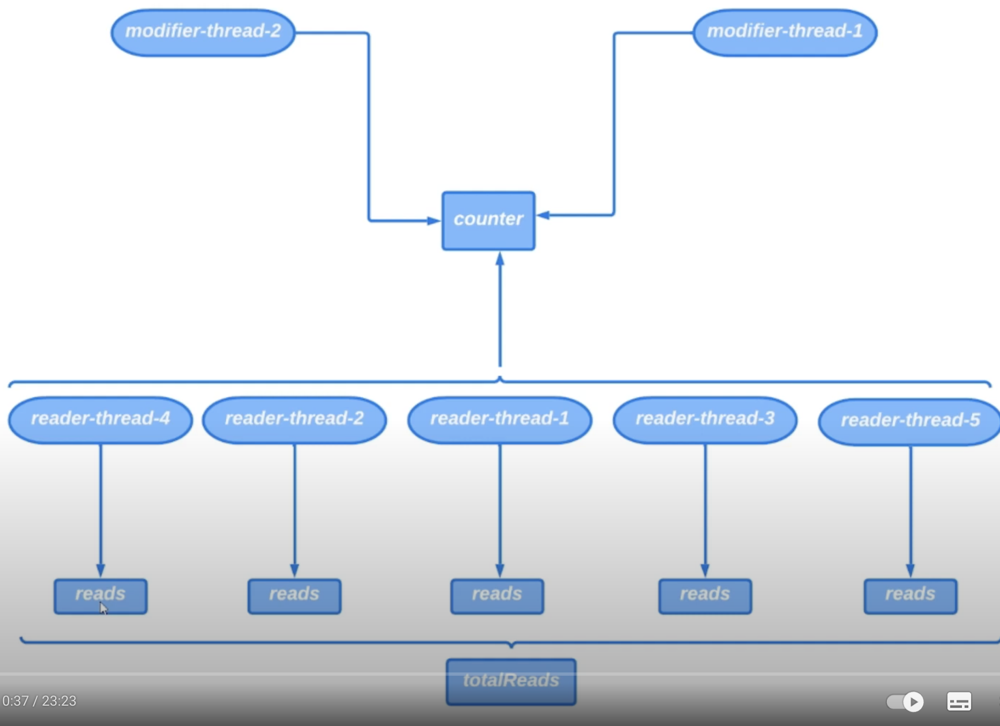

# 25. ReentrantReadWriteLock

Начнем сразу с примера. Представим, что есть объект `counter` и в программе запущено 5 потоков, которые читают
значение счетчика с помощью метода `getValue()`. Каждый читающий поток вызывает метод `getValue()` каждые 10 мс.
Также запущен поток, который инкрементирует счетчик с помощью метода `increment()` с периодичностью 5 с. 

Очевидно, что программа должна быть потокобезопасной, так как изменяемый счетчик находится в куче. Чтобы сделать
счетчик потокобезопасным можно использовать `synchronized` или явные блокировки. Все будет работать потокобезопасно,
но у этого решения есть свои недостатки.

Недостаток заключается в том, что пока 1 читающий поток будет считывать значение счетчика, то остальные
будут в состоянии `BLOCKED`.

Затем другой читающий поток захватит блокировку, а остальные читающие потоки будут заблокированы и т.д.
Получится так, что в 1 квант времени с нашим счетчиком может работать только 1 поток. Все остальные будут ждать
пока он закончит.

Было бы неплохо сделать так, что пока `modifier-thread` не начал изменять значение счетчика, все потоки которые
читают значение из счетчика могли работать параллельно. Так как `modifier-thread` изменяет значение счетчика
намного реже, чем читают оттуда значение мы сможем оптимизировать чтение.

Чтобы работа программы оставалась потокобезопасной надо изначально заблокировать все reader потоки, как только
modifier начнет изменять значение счетчика.

После изменения значения счетчика (инкремента) все reader-потоки должны быть разблокированы.

Такого поведения можно достичь, используя класс `ReentrantReadWriteLock`.

> Пример реализации доступен [здесь](../examples/25/src/Main.java).

Сравним 2 реализации счетчиков. Будет объект счетчика и мы запустим 2 потока, которые будут инкрементировать
счетчик с периодичностью в 1 секунду, пока потоки не прервут. Также запустим 5 потоков, которые будут читать
значение счетчика без задержек. У каждого потока будет свой счетчик сколько он раз успел считать значение.
Потом проссумируем значения счетчиков чтецов и получим общее количество чтений конкретного счетчика.

Невозможно предсказать улучшит ли производительность программы использование `ReentrantReadWriteLock`. 
Это зависит от нескольких параметров: насколько часто производятся операции чтения, чем операции записи. 
Время чтения и записи. При коротких операциях преимущества не проявляются.