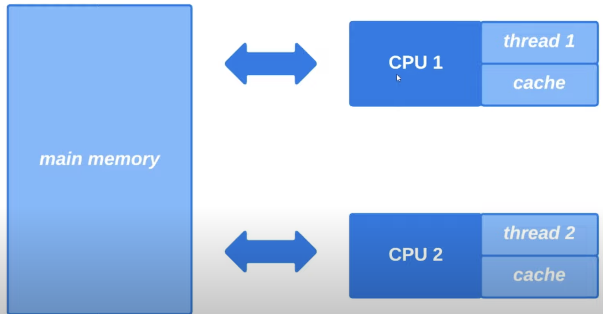
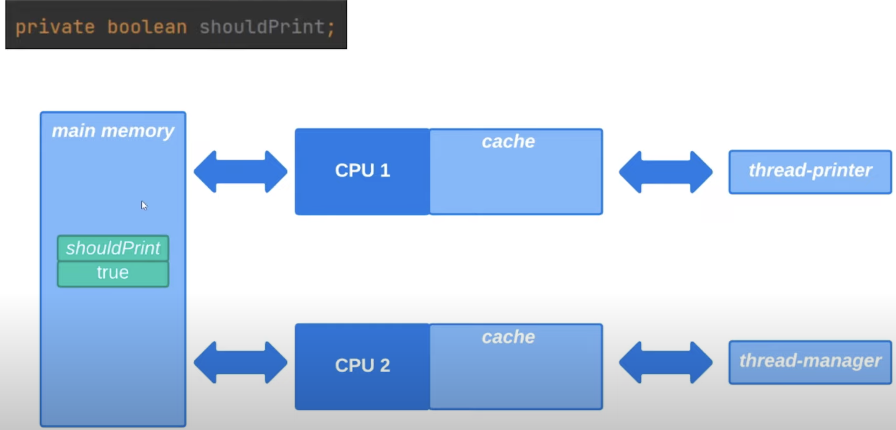
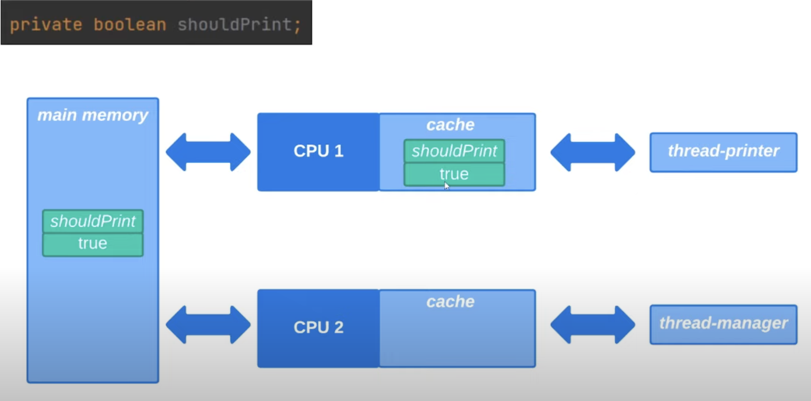
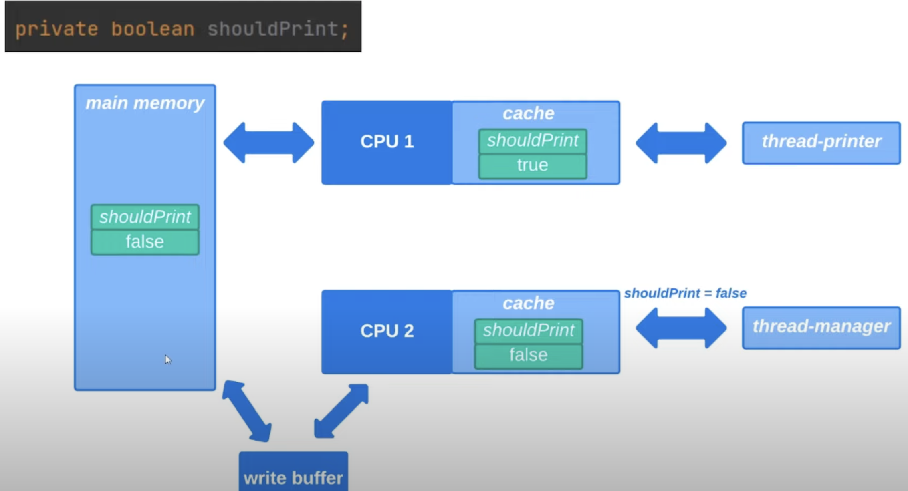
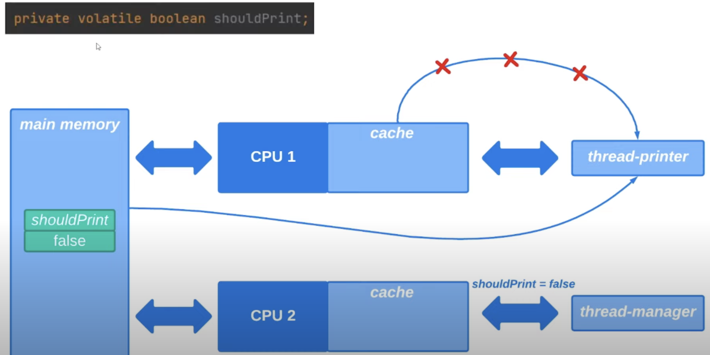
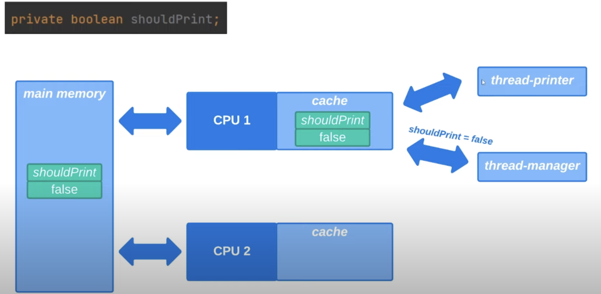

# 26. Volatile

Рассмотрим ключевое слово `volatile`. 

Рассмотрим процесс выполнения потоков. Представим, что есть 2 ядра ЦП и 2 потока. Каждый из этих потоков выполняется
своим ядром процессора. У каждого ядра процессора есть свой локальный кеш и эти кеши хранят наиболее часто
используемые данные и инструкции, чтобы ускорить доступ к ним. Так как извлечение данных из этих кешей выполняется
намного быстрее, чем из основной памяти. Именно поэтому ядра процессора склонны к тому, чтобы кешировать данные в
кешах для повышения производительности.

Представим, что было запущено 2 потока: `thread-printer` просто выводит на консоль информацию о том, что он работает
и перед каждым выводом на консоль он читает значение `shouldPrint` из основной памяти и если это значение `true`,
то поток делает вывод на консоль, если `shouldPrint=false`, то этот поток прекращает свою работу.

Также с первым потоком был запущен поток `thread-manager` и этот поток отвечает за то, чтобы изменить значение переменной
`shouldPrint` на `false` в основной памяти, чтобы остановить вывод на консоль, который выполняет `thread-printer`.

Представим, что наша программа начала свою работу и поток `thread-printer` начал свою работу. И поскольку этот
поток очень часто читает значение переменной `shouldPrint` из основной памяти, то ядро процессора этого потока
закеширует это значение в своем локальном кеше. И в последующем когда поток `thread-printer` захочет прочитать
значение переменной `shouldPrint` он будет читать значение этой переменной из локального кеша ядра процессора, 
а не из основной памяти.

Допустим `thread-printer` поработал какое-то время и затем поток `thread-manager` присвоил значение `false`
переменной `shouldPrint` и это значение попало в основную память. 

> Стоит отметить, что ядра склонны накапливать изменения в буфере, а затем за один раз все накопленные
> изменения добавить в основную память. Но для простоты будет считать, что после изменения `thread-manager`
> сразу обновили переменную `shouldPrint` в основную память.

Мы ожидаем, что после обновления переменной `shouldPrint` потоком `thread-manager` наш второй поток 
`thread-printer` увидит это изменение и прекратит свою работу, но стоит обратить внимание, что значение
переменной внутри локального кеша первого ядра все еще `true`. А поток `thread-printer` будет читать значение
этой переменной из локального кеша своего ядра процессора. Поэтому `thread-printer` не увидит изменений
в основной памяти. 

Поэтому нам нужен механизм, который скажет всем потокам читать значение переменной `shouldPrint` всегда
из основной памяти, а не из локальных кешей ядер процессора, для того, чтобы все изменения сделанные 1 потоком
были сразу видны другим потокам. Для этого мы можем использовать ключевое слово `volatile`.

> Не следует использовать слово `volatile` без особых причин, поскольку чтение из локальных кешей
> выполняется быстрее, чем из основной памяти.

Также если бы переменная `shouldPrint` не была бы объявлена с ключевым словом `volatile` и 2 потока
выполнялись 1 ядром процессора, то ранее рассмотренной проблемы не возникало, так как эти 2 потока
разделяли бы общий локальный кеш ядра.

> Пример доступен [здесь](../examples/26/src/Main.java).