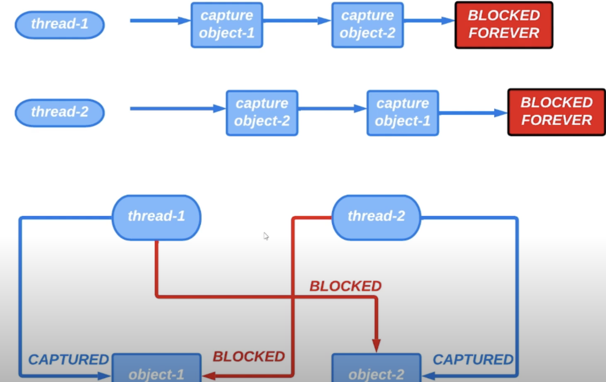
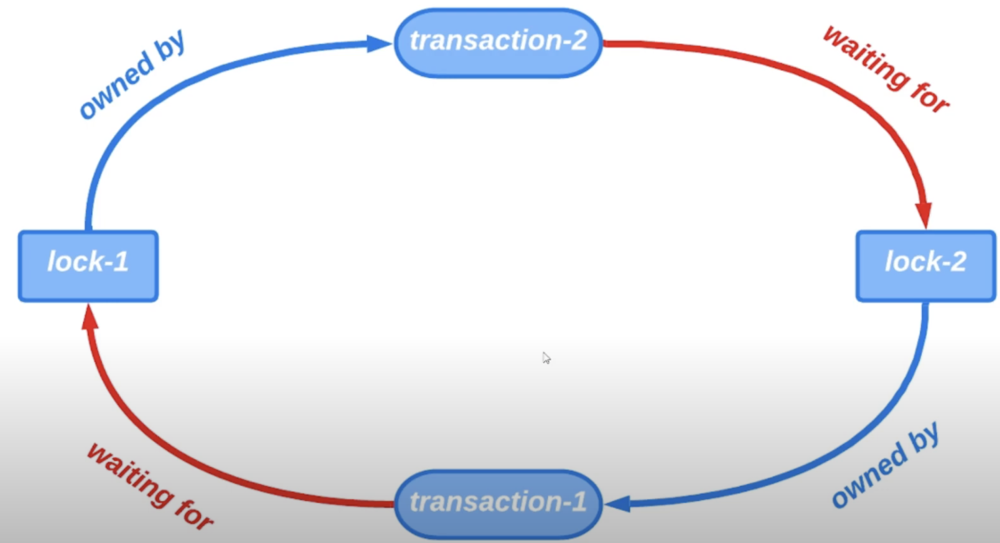
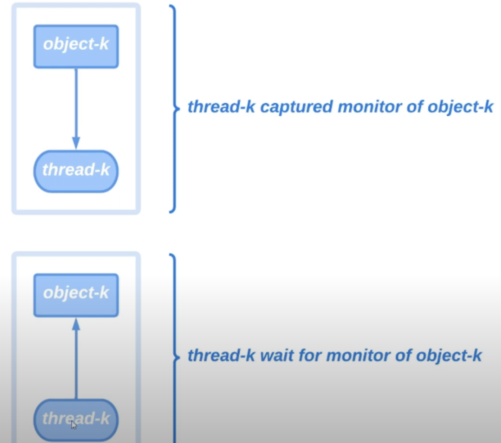
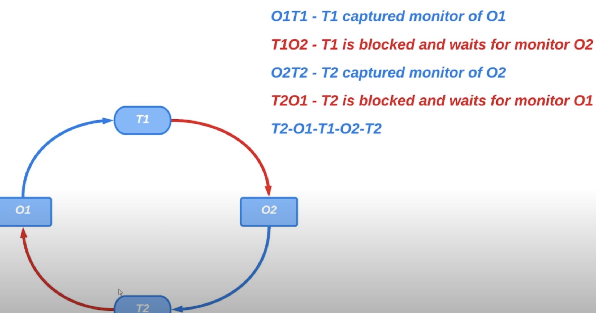
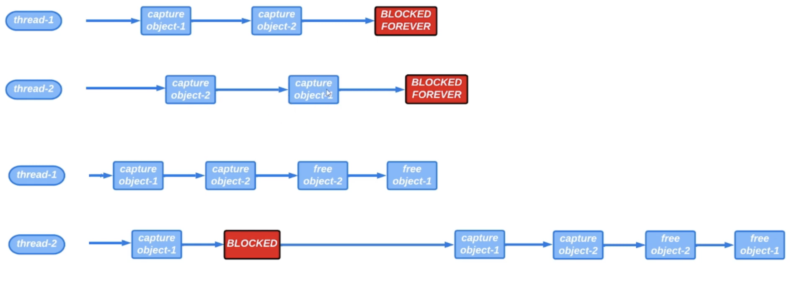

# 27. Deadlock

Представим, что есть 2 объекта. Работа с каждым из объектов должна быть потокобезопасной, поэтому поток 
перед тем как начать работу с объектом должен сначала захватить монитор этого объекта. Представим, что было
запущено 2 потока каждый из которых должен произвести некоторую работу с 2 объектами.

Сначала поток с именем `thread-1` успешно захватил монитор `object-1`. Потом поток `thread-2` захватил монитор
`object-2`, так как этот монитор не был ранее захвачен. Затем `thread-1` пытается захватить монитор `object-2`,
но этот монитор уже был ранее захвачен 2 потоком и 1 поток будет находиться в состоянии `BLOCKED` до тех
пор пока 2 поток не освободит данный монитор.

Затем 2 поток попытается захватить монитор `object-1`, но монитор этого объекта уже был ранее захвачен `thread-1`.
Поэтому 2 поток будет теперь также находиться в состоянии `BLOCKED`, пока 1 поток не освободит данный монитор.

Получается так, что 1 поток ждет пока 2 поток освободит монитор второго объекта, а 2 поток ждет пока 1
поток освободит монитор первого объекта. При этом 1 и 2 поток в ожидании удерживают мониторы захваченных объектов.

Таким образом все потоки будут в состоянии `BLOCKED` бесконечное количество времени. Это состояние называется
Deadlock.

Базы данных умеют восстанавливаться в случае взаимных блокировок. Транзакция в процессе работы может захватить
много замков и эти замки будут удерживаться до фиксации транзакции. Поэтому вполне возможно появление взаимной
блокировки.

Проанализировать процесс на наличие взаимной блокировки можно следующим образом: можно построить граф у которого
будет 2 вида узлов. 1 вид узлов - это потоки, а 2 - это объекты, мониторы которых захватываются этими потоками.
Наличие связи между узлами означает, что монитор объекта захвачен потоком.

Deadlock будет выглядеть следующим образом:

Наличие циклической структуры графа означает, что мы имеем дело с взаимной блокировкой.

Как обезопаситься от риска возникновения взаимной блокировки? Для этого надо следовать 1 правилу, которое
говорит, что все потоки в нашей программе должны захватывать мониторы объектов в одном и том же порядке.

> В верхнем случае возможна взаимная блокировка, а в нижнем, мониторы захватываются в одном и том же порядке

