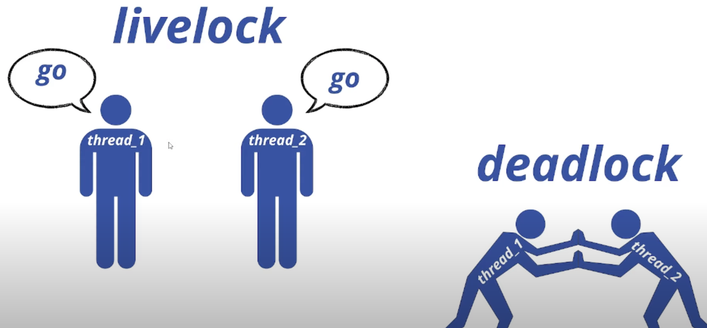
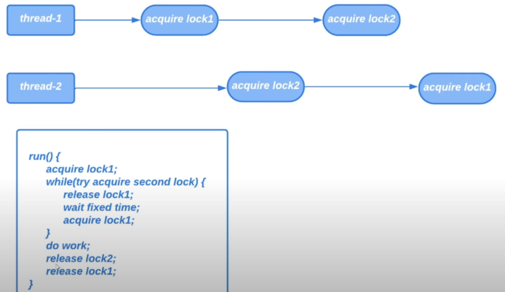

# 28. Livelock (активная блокировка)

Активная блокировка это сбой при котором все потоки не находятся в состоянии `BLOCKED` (как при DeadLock),
они не смогут выполнять работу, так как всегда будут пытаться выполнить операцию, которая всегда безуспешна.

Если приводить пример из реальной жизни, то Livelock это когда 2 очень вежливых человека идут в разных направлениях
и каждый уступает дорогу другому и так до бесконечности. В отличие от Deadlock когда потоки мешают друг другу,
потоки чересчур вежливы друг к другу и каждый раз будут выполнять операцию, которая будет безуспешной.

Рассмотрим следующий пример: будут 2 потока, каждый из которых для выполнения работы должен захватить 2 замка.
1 поток сначала захватывает 1 замок, потом 2. 2 поток наоборот сначала захватывает 2, потом 1. Здесь есть
риск возникновения Deadlock. Чтобы избавиться от этого риска надо захватывать замки по очереди. 

Можно попробовать избавиться от Deadlock иначе: захватываем 1 замок, потом каждый поток пытается захватить 2 замок
с помощью метода `tryLock` и если попытка захвата 2 замка была неудачной, мы освобождаем 1 замок, чтобы избавиться
от Deadlock. Затем ожидаем время, чтобы дать 2 потоку выполнить свою работу. Затем освобождаем 1 замок. Пытаемся
захватить 2 замок и так до тех пор пока оба замка не будут захвачены, выполняем работу и освобождаем замки.

> Пример доступен [здесь](../examples/28/src/Main.java).