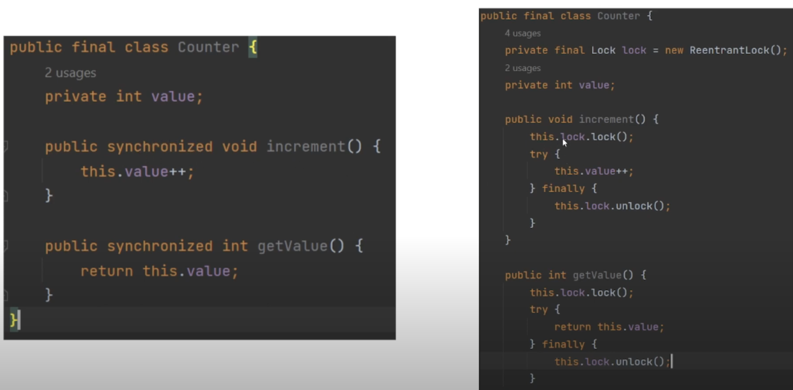
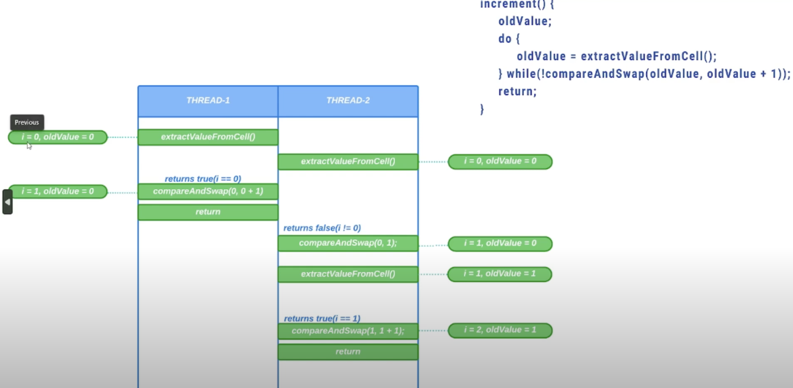

# 29. Недостатки замковой защиты + CAS

Сегодня мы рассмотрим недостатки замковой защиты и атомарную операцию Compare And Swap (CAS). 
И начнем с рассмотрения недостатков замковой защиты. 
Давайте вспомним, как мы ранее писали класс счетчика. 
У нас был класс `Counter`, у которого было целочисленное поле `value`. 
И внутри этого класса были определены два метода: `increment` и `getValue`. 
Для того, чтобы сделать работу с нашим классом потокобезопасной, 
мы могли использовать либо ключевое слово `synchronized`, либо использовать явные блокировки.

Если мы применяем один из ранее представленных способов защиты, 
то у нас получается следующая картина. 
Весь код между захватом замка или монитора и его освобождением может одновременно 
выполняться только одним потоком. Все остальные потоки будут заблокированы, 
до тех пор пока поток Thread-n, ранее захвативший данный замок, освободит его. 
Затем следующий поток захватывает замок, а все остальные будут заблокированы. И так далее.

То есть потоки будут просто поочередно захватывать замок, выполнять код, затем освобождать замок, 
что сильно ухудшает пропускную способность. В этом и заключается проблема замков. 
Помимо этого, что например, если поток, владеющий замком, задерживается по какой-то из причин, 
например из-за задержки планирования. Или что, например, если поток, владеющий замком, вообще 
блокирован навсегда, например из-за возникновения Deadlock. 
Как вы понимаете, это может быть серьезной проблемой, так как потоки, ожидающие захвата замка, 
также не смогут продолжать свою работу. Даже игнорируя все ранее сказанные сбои, замковая защита 
сама по себе просто тяжеловесна.

Как мы только что поняли, блокировки могут часто приводить к проблемам производительности, 
но к счастью решение этих проблем существует. 
Но перед тем, как мы приступим к рассмотрению инструментов для решения этих проблем, 
нам необходимо рассмотреть атомарную операцию Compare And Swap или CAS. 

Атомарная операция CAS позволяет обеспечить потокобезопасность без использования блокировок. 
CAS – это эффективная неблокирующая альтернатива для обеспечения потокобезопасности операций.

И тут надо отметить, что алгоритм называется неблокирующим, 
если сбой или приостановка одного потока не вызывает сбой или приостановку другого потока. 

Операция CAS имеет три операнда: 
1. Ячейка памяти cell, на которой выполняются все операции
2. Ожидаемое значение этой ячейки (expected)
3. Новое значение ячейки (new)

Ниже представлена логика работы операции CAS. 
Операция CAS принимает в себя два аргумента. 
Это старое ожидаемое значение нашей ячейки и новое значение этой ячейки.

Сначала мы из ячейки памяти достаем ее текущее значение. 
Затем мы сравниваем это значение с ожидаемым значением. 
Если эти значения равны, мы кладем новое значение в нашу ячейку и возвращаем `true`, 
что означает, что операция CAS была выполнена успешно. 
Если старое значение не равно ожидаемому, то мы возвращаем `false`, 
что означает, что операция CAS не была выполнена успешно, 
так как уже какой-то другой поток успел изменить значение в нашей ячейке памяти. 
Исходя из возвращаемого значения, вызывающая сторона может принять решение, 
предпринять дальнейшие попытки изменения или нет.

В Java методы Compare And Swap являются нативными и выполняются атомарно. 
И давайте разберем на примере, как можно было бы использовать CAS операцию для обеспечения 
потокобезопасной операции инкремента. 

Допустим, у нас было запущено два потока, каждый из которых должен произвести 
по одной операции инкремента над каким-то значением `i`, находящимся в куче. 
Изначально это значение равно `0`.
В методе инкремента мы просто каждый раз извлекаем текущее значение нашей ячейки до тех пор пока операция CAS 
вызывающаяся в условии цикла `do while` не даст положительный результат. 
В качестве аргумента ожидаемого значения передаем `oldValue`. Это значение которое находилось 
в нашей ячейке до текущей операции инкремента. В качестве нового значения нашей ячейки передаем 
`oldValue + 1`, чтобы произвести операцию инкремента.

Итак, у нас было запущено два потока. Сначала первый поток извлекает текущее значение из нашей ячейки памяти. 
Сейчас у нас `i = 0`, соответственно `oldValue` тоже будет равняться `0`. 
Затем второй поток также извлекает текущее значение ячейки памяти. 
Опять, текущее значение ячейки памяти у нас равняется `0`, соответственно, `oldValue` тоже будет равняться `0`. 
Затем первый поток вызывает CAS операцию, передав в качестве ожидаемого значения `oldValue`, то есть `0`, 
а в качестве нового значения нашей ячейки `oldValue + 1`, то есть единицу.

Текущее значение нашей ячейки памяти действительно равно ожидаемому значению 
нашей CAS операции, так как у нас `i = 0`, и `oldValue = 0`. 
Поэтому CAS операция завершится успешно, заменив наше текущее значение ячейки памяти на 1. 
Затем первый поток заканчивает свою работу. 
Затем второй поток применяет CAS операцию, передав в качестве ожидаемого значения `oldValue`, то есть `0`, 
а в качестве нового значения нашей ячейки `oldValue + 1`, то есть `1`. 
Значение нашей ячейки уже успел инкрементировать первый поток, поэтому здесь CAS операция 
выполнится безуспешно, потому что на текущий момент у нас значение нашей ячейки уже равняется `1`, 
а мы в качестве ожидаемого значения передали `0`. 
Поэтому второй поток снова извлекает значение из нашей ячейки памяти и теперь `oldValue` равняется `1`. 
Второй поток пытается снова применить CAS операцию, передав в качестве ожидаемого значения ячейки `oldValue`, 
то есть единицу, а в качестве нового значения `oldValue + 1`, то есть два.

Сейчас CAS операция завершится успешно, так как значение ячейки действительно равно ожидаемому значению, 
то есть единице. Поэтому теперь значение ячейки, как мы ожидали, равняется двум и второй 
поток заканчивает свою работу. 

Обозначим преимущества CAS:
1. Первое преимущество CAS заключается в том, что CAS это более низкозатратная операция, 
чем механизмы блокировки;
2. Второе преимущество CAS заключается в том, что CAS представляет собой неблокирующий подход синхронизации, 
что улучшает производительность приложения;
3. Третье преимущество CAS заключается в том, что CAS позволяет реализовать оптимистичный подход, 
который может работать эффективно в условиях низкой конкурентности между потоками. 
В этом подходе мы можем понять, вмешивались ли другие потоки во время выполнения операции. 
Если вмешивались, то операция дает сбой. И дальше мы решаем, пытаться снова выполнить эту операцию или нет. 

И также обозначим недостатки CAS:
1. Первый недостаток заключается в том, что CAS может привести к проблеме голодания, 
когда один поток постоянно безуспешно выполняет CAS операцию из-за конкуренции с другими потоками;
2. Второй недостаток CAS заключается в том, что CAS может приводить к проблеме ABA. 
Фактически в CAS мы спрашиваем, равно ли старое значение ячейки ожидаемому. 
Ну что, например, если мы ожидаем значение A, но перед операцией CAS значение 
в ячейке поменялось сначала на B, затем снова на A.
То есть значение в ячейке поменялось, хоть и на то же самое. Это и есть проблема ABA. 

На следующем уроке мы рассмотрим класс атомарных переменных, которые позволяют 
обеспечить неблокирующую синхронизацию.