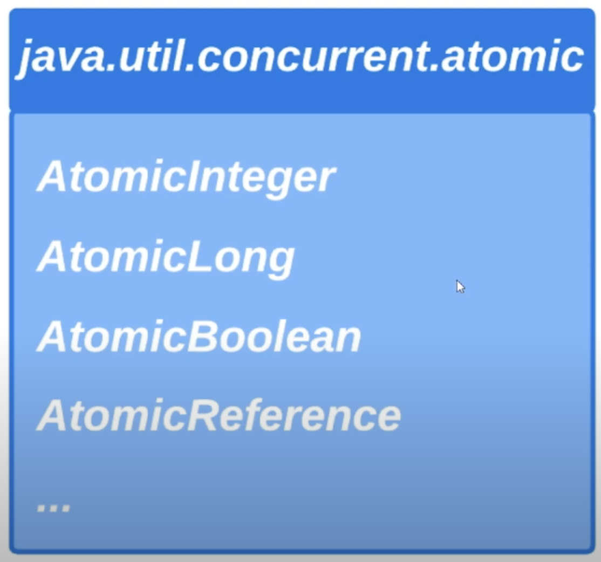
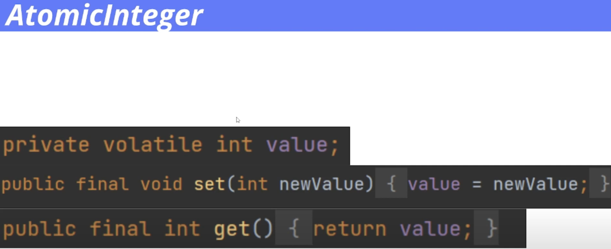
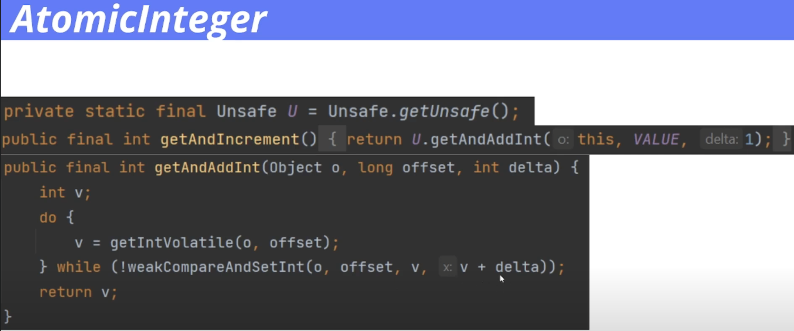

# 30. Классы атомарных переменных

Как мы обсуждали в [прошлом уроке](./29_cas.md), блокировки могут часто приводить к проблеме производительности. 
И мы рассмотрели альтернативный неблокирующий подход, который можно было бы использовать 
для обеспечения потокобезопасности операций, используя атомарную операцию CAS. 

В Java существуют классы атомарных переменных, которые предоставляют различные потокобезопасные операции. 
Эти классы используют именно неблокирующий подход для обеспечения потокобезопасности операций.

Наиболее часто используемыми классами являются класс `AtomicInteger` для потокобезопасной работы 
с целочисленными значениями, `AtomicLong` для потокобезопасной работы с Long-значениями, `AtomicBoolean` для 
потокобезопасной работы с значениями типа `Boolean` и `AtomicReference` для потокобезопасной работы со ссылками. 
Все эти классы находятся в пакете в `java.util.concurrent.atomic`. Все они поддерживают операцию CAS, 
а классы `AtomicInteger` и `AtomicLong` также поддерживают различные потокобезопасные арифметические операции.

На практике для простоты можно представлять себе, что каждый метод какой-то атомарной переменной 
просто объявлен с ключевым словом `synchronized`, но не лишним будет знать, как это все работает под капотом. 

Мы рассмотрим работу с экземплярами этих классов на примере с экземпляром класса `AtomicInteger`. 
Если мы заглянем внутрь класса `AtomicInteger`, мы увидим методы `set` и `get`, которые работают с полем типа `int`.

Поле `value` объявлено с ключевым словом `volatile`, для того, чтобы значение поля `value` всегда читалось именно 
из основной памяти, а не из локального кэша ядер процессора для того, чтобы все изменения, сделанные одним потоком, 
были бы сразу видны другим потоком. 

На прошлом уроке мы уже рассматривали как можно обеспечить потокобезопасность операции инкремента 
использовав атомарную операцию CAS. Внутри класса `AtomicInteger` есть метод `getAndIncrement`, который атомарно 
инкрементирует значение поля `value` и возвращает его значение до выполнения операции инкремента.
Внутри тела этого метода вызывается метод `getAndAddInt` на экземпляре класса `Unsafe`. 
И как вы видите, код внутри тела этого метода очень похож на код, который мы разбирали на прошлом уроке. 
В теле этого метода определен цикл `do while`, в котором мы каждый раз извлекаем текущее значение ячейки памяти, 
до тех пор, пока атомарная операция CAS не завершится успешно. Передав в качестве ожидаемого значения `v`, 
то есть значение, которое у нас было до текущей операции инкремента, и в качестве нового значения `v` плюс дельта. 
В данном случае дельта равна единице. 

И давайте приступим к практике. 
Мы реализуем потокобезопасный генератор четных чисел при помощи экземпляра класса `AtomicInteger`. 
И давайте создадим класс, экземпляра которого будут собой представлять генераторы черных чисел. 

> Пример доступен [здесь](../examples/30/src/Main.java).